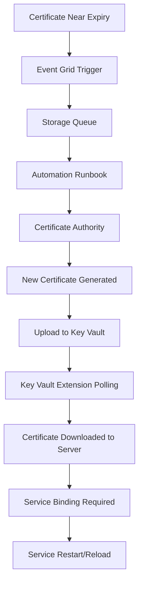
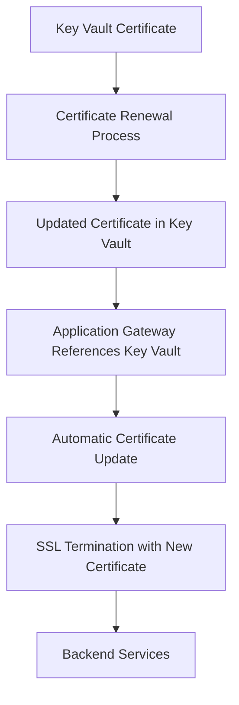

# Certificate Lifecycle Management - Target Server Integration Reference

## Table of Contents
1. [Overview](#overview)
2. [Azure Key Vault Extension Integration](#azure-key-vault-extension-integration)
3. [Azure CLI Shell Scripts for Linux](#azure-cli-shell-scripts-for-linux)
4. [Azure Application Gateway Integration](#azure-application-gateway-integration)
5. [Apache HTTP Server Integration](#apache-http-server-integration)
6. [Apache Tomcat Integration](#apache-tomcat-integration)
7. [Monitoring and Troubleshooting](#monitoring-and-troubleshooting)

## Overview

The Azure Certificate Lifecycle Management solution automatically renews certificates and deploys them to target servers. This document provides comprehensive guidance on how different types of servers and services can integrate with the certificate renewal system.

### Certificate Deployment Workflow



## Azure Key Vault Extension Integration

### How Target Servers Detect Certificate Updates

Target servers use the **Azure Key Vault Extension** with a polling mechanism to automatically detect and download renewed certificates from Azure Key Vault.

### Key Features:
- **Automatic Detection**: Polls Key Vault at configurable intervals (default: 12 hours)
- **Version Management**: Automatically detects new certificate versions
- **Local Installation**: Downloads and installs certificates to local certificate stores
- **Multi-Platform Support**: Available for Windows, Linux, and Azure Arc servers

### Windows Server Configuration

```powershell
# Install Key Vault Extension for Windows Server
$ResourceGroupName = "your-resource-group"
$VmName = "your-windows-server"
$KeyVaultName = "your-key-vault-name"
$CertificateName = "your-certificate-name"
$PollingInterval = "43200"  # 12 hours in seconds

$Settings = @{
    secretsManagementSettings = @{
        pollingIntervalInS = $PollingInterval
        linkOnRenewal = $false
        observedCertificates = @(
            @{
                url = "https://$KeyVaultName.vault.azure.net:443/secrets/$CertificateName"
                certificateStoreName = "My"               # Personal certificate store
                certificateStoreLocation = "LocalMachine"  # Machine-level store
                keyExportable = $true
                accounts = @("Network Service", "Local Service", "IIS_IUSRS")
            }
        )
    }
    authenticationSettings = @{
        msiEndpoint = "http://169.254.169.254/metadata/identity"
    }
}

# Deploy the extension
Set-AzVMExtension -ResourceGroupName $ResourceGroupName `
    -VMName $VmName `
    -Name "KeyVaultForWindows" `
    -Publisher "Microsoft.Azure.KeyVault" `
    -Type "KeyVaultForWindows" `
    -TypeHandlerVersion "3.0" `
    -SettingString ($Settings | ConvertTo-Json -Depth 10) `
    -EnableAutomaticUpgrade $true
```

### Linux Server Configuration

```powershell
# Install Key Vault Extension for Linux Server
$ResourceGroupName = "your-resource-group"
$VmName = "your-linux-server"
$KeyVaultName = "your-key-vault-name"
$CertificateName = "your-certificate-name"
$PollingInterval = "43200"  # 12 hours in seconds

$Settings = @{
    secretsManagementSettings = @{
        pollingIntervalInS = $PollingInterval
        certificateStoreLocation = "/var/lib/waagent/Microsoft.Azure.KeyVault/certs"
        observedCertificates = @(
            "https://$KeyVaultName.vault.azure.net:443/secrets/$CertificateName"
        )
    }
    authenticationSettings = @{
        msiEndpoint = "http://169.254.169.254/metadata/identity"
    }
}

# Deploy the extension
Set-AzVMExtension -ResourceGroupName $ResourceGroupName `
    -VMName $VmName `
    -Name "KeyVaultForLinux" `
    -Publisher "Microsoft.Azure.KeyVault" `
    -Type "KeyVaultForLinux" `
    -TypeHandlerVersion "2.0" `
    -SettingString ($Settings | ConvertTo-Json -Depth 10) `
    -EnableAutomaticUpgrade $true
```

### Required RBAC Permissions

```powershell
# Assign Key Vault Secret User role to target server managed identity
$SubscriptionId = "your-subscription-id"
$ResourceGroupName = "your-resource-group"
$KeyVaultName = "your-key-vault"
$VmName = "your-target-server"

# Get VM managed identity
$VM = Get-AzVM -ResourceGroupName $ResourceGroupName -Name $VmName
$ManagedIdentityId = $VM.Identity.PrincipalId

# Get Key Vault resource ID
$KeyVaultResourceId = "/subscriptions/$SubscriptionId/resourceGroups/$ResourceGroupName/providers/Microsoft.KeyVault/vaults/$KeyVaultName"

# Assign role
New-AzRoleAssignment -ObjectId $ManagedIdentityId `
    -RoleDefinitionName "Key Vault Secret User" `
    -Scope $KeyVaultResourceId
```

## Azure CLI Shell Scripts for Linux

### Script 1: Install Key Vault Extension on Linux VM

```bash
#!/bin/bash

# =============================================================================
# Install Azure Key Vault Extension on Linux VM
# =============================================================================

set -e

# Configuration variables
RESOURCE_GROUP_NAME="${1:-your-resource-group}"
VM_NAME="${2:-your-linux-server}"
KEY_VAULT_NAME="${3:-your-key-vault}"
CERTIFICATE_NAME="${4:-your-certificate}"
POLLING_INTERVAL="${5:-43200}"  # 12 hours
LOCATION="${6:-eastus}"

# Colors for output
RED='\033[0;31m'
GREEN='\033[0;32m'
YELLOW='\033[1;33m'
NC='\033[0m'

echo -e "${GREEN}Installing Azure Key Vault Extension on Linux VM...${NC}"

# Validate prerequisites
echo -e "${YELLOW}Validating prerequisites...${NC}"

if ! command -v az &> /dev/null; then
    echo -e "${RED}ERROR: Azure CLI is not installed${NC}"
    exit 1
fi

if ! az account show &> /dev/null; then
    echo -e "${RED}ERROR: Not logged in to Azure CLI${NC}"
    exit 1
fi

# Check if VM exists
if ! az vm show --name "$VM_NAME" --resource-group "$RESOURCE_GROUP_NAME" &> /dev/null; then
    echo -e "${RED}ERROR: VM '$VM_NAME' not found in resource group '$RESOURCE_GROUP_NAME'${NC}"
    exit 1
fi

# Check if Key Vault exists
if ! az keyvault show --name "$KEY_VAULT_NAME" &> /dev/null; then
    echo -e "${RED}ERROR: Key Vault '$KEY_VAULT_NAME' not found${NC}"
    exit 1
fi

echo -e "${GREEN}✓ Prerequisites validated${NC}"

# Get VM managed identity
echo -e "${YELLOW}Checking VM managed identity...${NC}"
VM_IDENTITY=$(az vm identity show --name "$VM_NAME" --resource-group "$RESOURCE_GROUP_NAME" --query "principalId" -o tsv 2>/dev/null || echo "")

if [ -z "$VM_IDENTITY" ] || [ "$VM_IDENTITY" = "null" ]; then
    echo -e "${YELLOW}Enabling system-assigned managed identity...${NC}"
    VM_IDENTITY=$(az vm identity assign --name "$VM_NAME" --resource-group "$RESOURCE_GROUP_NAME" --query "systemAssignedIdentity" -o tsv)
fi

echo -e "${GREEN}✓ VM Managed Identity: $VM_IDENTITY${NC}"

# Assign Key Vault permissions
echo -e "${YELLOW}Assigning Key Vault permissions...${NC}"
SUBSCRIPTION_ID=$(az account show --query "id" -o tsv)
KEY_VAULT_SCOPE="/subscriptions/$SUBSCRIPTION_ID/resourceGroups/$RESOURCE_GROUP_NAME/providers/Microsoft.KeyVault/vaults/$KEY_VAULT_NAME"

# Check if role assignment already exists
if az role assignment list --assignee "$VM_IDENTITY" --role "Key Vault Secret User" --scope "$KEY_VAULT_SCOPE" --query "[0].id" -o tsv | grep -q .; then
    echo -e "${GREEN}✓ Key Vault Secret User role already assigned${NC}"
else
    az role assignment create \
        --assignee "$VM_IDENTITY" \
        --role "Key Vault Secret User" \
        --scope "$KEY_VAULT_SCOPE"
    echo -e "${GREEN}✓ Key Vault Secret User role assigned${NC}"
fi

# Create extension settings
EXTENSION_SETTINGS=$(cat <<EOF
{
    "secretsManagementSettings": {
        "pollingIntervalInS": "$POLLING_INTERVAL",
        "certificateStoreLocation": "/var/lib/waagent/Microsoft.Azure.KeyVault/certs",
        "observedCertificates": [
            "https://$KEY_VAULT_NAME.vault.azure.net:443/secrets/$CERTIFICATE_NAME"
        ]
    },
    "authenticationSettings": {
        "msiEndpoint": "http://169.254.169.254/metadata/identity"
    }
}
EOF
)

# Install Key Vault extension
echo -e "${YELLOW}Installing Key Vault extension...${NC}"
if az vm extension show --vm-name "$VM_NAME" --resource-group "$RESOURCE_GROUP_NAME" --name "KeyVaultForLinux" &> /dev/null; then
    echo -e "${YELLOW}Extension already exists, updating...${NC}"
    az vm extension set \
        --vm-name "$VM_NAME" \
        --resource-group "$RESOURCE_GROUP_NAME" \
        --name "KeyVaultForLinux" \
        --publisher "Microsoft.Azure.KeyVault" \
        --version "2.0" \
        --settings "$EXTENSION_SETTINGS" \
        --enable-auto-upgrade true
else
    echo -e "${YELLOW}Installing new extension...${NC}"
    az vm extension set \
        --vm-name "$VM_NAME" \
        --resource-group "$RESOURCE_GROUP_NAME" \
        --name "KeyVaultForLinux" \
        --publisher "Microsoft.Azure.KeyVault" \
        --version "2.0" \
        --settings "$EXTENSION_SETTINGS" \
        --enable-auto-upgrade true
fi

echo -e "${GREEN}✓ Key Vault extension installed successfully${NC}"

# Verification
echo -e "${YELLOW}Verifying installation...${NC}"
az vm extension show \
    --vm-name "$VM_NAME" \
    --resource-group "$RESOURCE_GROUP_NAME" \
    --name "KeyVaultForLinux" \
    --query "{Name:name, Publisher:publisher, Version:typeHandlerVersion, ProvisioningState:provisioningState}" \
    --output table

echo -e "${GREEN}"
echo "==============================================================================="
echo "Key Vault Extension Installation Complete"
echo "==============================================================================="
echo "VM Name: $VM_NAME"
echo "Key Vault: $KEY_VAULT_NAME"
echo "Certificate: $CERTIFICATE_NAME"
echo "Polling Interval: $POLLING_INTERVAL seconds"
echo "Certificate Store Location: /var/lib/waagent/Microsoft.Azure.KeyVault/certs"
echo ""
echo "The extension will poll for certificate updates every $(($POLLING_INTERVAL / 3600)) hours."
echo "Certificates will be stored in: /var/lib/waagent/Microsoft.Azure.KeyVault/certs/"
echo "==============================================================================="
echo -e "${NC}"
```

### Script 2: Monitor Certificate Updates on Linux

```bash
#!/bin/bash

# =============================================================================
# Monitor Certificate Updates from Key Vault Extension
# =============================================================================

set -e

# Configuration
CERT_STORE_PATH="/var/lib/waagent/Microsoft.Azure.KeyVault/certs"
CERTIFICATE_NAME="${1:-your-certificate}"
LOG_FILE="/var/log/keyvault-cert-monitor.log"

# Colors for output
RED='\033[0;31m'
GREEN='\033[0;32m'
YELLOW='\033[1;33m'
NC='\033[0m'

# Function to log with timestamp
log_message() {
    echo "$(date '+%Y-%m-%d %H:%M:%S') - $1" | tee -a "$LOG_FILE"
}

echo -e "${GREEN}Certificate Update Monitor${NC}"
echo -e "${YELLOW}Monitoring certificate: $CERTIFICATE_NAME${NC}"
echo -e "${YELLOW}Certificate store: $CERT_STORE_PATH${NC}"

# Check if certificate store exists
if [ ! -d "$CERT_STORE_PATH" ]; then
    echo -e "${RED}ERROR: Certificate store path does not exist: $CERT_STORE_PATH${NC}"
    echo -e "${YELLOW}Make sure the Key Vault extension is installed and running${NC}"
    exit 1
fi

# Monitor for certificate changes
log_message "Starting certificate monitoring for: $CERTIFICATE_NAME"

# Function to get certificate info
get_cert_info() {
    local cert_path="$1"
    if [ -f "$cert_path" ]; then
        # Get certificate details using openssl
        local subject=$(openssl x509 -in "$cert_path" -noout -subject 2>/dev/null | sed 's/subject=//')
        local not_after=$(openssl x509 -in "$cert_path" -noout -enddate 2>/dev/null | sed 's/notAfter=//')
        local fingerprint=$(openssl x509 -in "$cert_path" -noout -fingerprint -sha256 2>/dev/null | sed 's/SHA256 Fingerprint=//')
        
        echo "Subject: $subject"
        echo "Expires: $not_after"
        echo "Fingerprint: $fingerprint"
    else
        echo "Certificate file not found"
    fi
}

# Initial certificate check
echo -e "${YELLOW}Initial certificate status:${NC}"
CERT_FILE="$CERT_STORE_PATH/$CERTIFICATE_NAME.crt"
if [ -f "$CERT_FILE" ]; then
    get_cert_info "$CERT_FILE"
    LAST_MODIFIED=$(stat -c %Y "$CERT_FILE" 2>/dev/null || echo "0")
else
    echo "Certificate not yet downloaded"
    LAST_MODIFIED="0"
fi

# Monitor for changes
echo -e "${YELLOW}Monitoring for certificate updates (Press Ctrl+C to stop)...${NC}"

while true; do
    if [ -f "$CERT_FILE" ]; then
        CURRENT_MODIFIED=$(stat -c %Y "$CERT_FILE" 2>/dev/null || echo "0")
        
        if [ "$CURRENT_MODIFIED" != "$LAST_MODIFIED" ]; then
            log_message "Certificate update detected!"
            echo -e "${GREEN}Certificate updated:${NC}"
            get_cert_info "$CERT_FILE"
            
            # Trigger service reload/restart here if needed
            # systemctl reload apache2
            # systemctl restart tomcat
            
            LAST_MODIFIED="$CURRENT_MODIFIED"
        fi
    fi
    
    sleep 60  # Check every minute
done
```

### Script 3: Certificate Deployment for Apache/Tomcat

```bash
#!/bin/bash

# =============================================================================
# Deploy Certificate to Apache/Tomcat from Key Vault Extension
# =============================================================================

set -e

# Configuration
CERT_STORE_PATH="/var/lib/waagent/Microsoft.Azure.KeyVault/certs"
CERTIFICATE_NAME="${1:-your-certificate}"
SERVICE_TYPE="${2:-apache}"  # apache or tomcat
APACHE_SSL_DIR="/etc/apache2/ssl"
TOMCAT_SSL_DIR="/opt/tomcat/ssl"
LOG_FILE="/var/log/cert-deployment.log"

# Colors for output
RED='\033[0;31m'
GREEN='\033[0;32m'
YELLOW='\033[1;33m'
NC='\033[0m'

# Function to log with timestamp
log_message() {
    echo "$(date '+%Y-%m-%d %H:%M:%S') - $1" | tee -a "$LOG_FILE"
}

echo -e "${GREEN}Certificate Deployment Script${NC}"
log_message "Starting certificate deployment for $SERVICE_TYPE"

# Validate inputs
if [ "$SERVICE_TYPE" != "apache" ] && [ "$SERVICE_TYPE" != "tomcat" ]; then
    echo -e "${RED}ERROR: SERVICE_TYPE must be 'apache' or 'tomcat'${NC}"
    exit 1
fi

# Check if certificate exists
CERT_FILE="$CERT_STORE_PATH/$CERTIFICATE_NAME.crt"
KEY_FILE="$CERT_STORE_PATH/$CERTIFICATE_NAME.key"

if [ ! -f "$CERT_FILE" ]; then
    echo -e "${RED}ERROR: Certificate file not found: $CERT_FILE${NC}"
    exit 1
fi

if [ ! -f "$KEY_FILE" ]; then
    echo -e "${RED}ERROR: Private key file not found: $KEY_FILE${NC}"
    exit 1
fi

log_message "Certificate files found: $CERT_FILE, $KEY_FILE"

# Deploy based on service type
if [ "$SERVICE_TYPE" = "apache" ]; then
    echo -e "${YELLOW}Deploying certificate for Apache...${NC}"
    
    # Create SSL directory if it doesn't exist
    sudo mkdir -p "$APACHE_SSL_DIR"
    
    # Copy certificate and key
    sudo cp "$CERT_FILE" "$APACHE_SSL_DIR/"
    sudo cp "$KEY_FILE" "$APACHE_SSL_DIR/"
    
    # Set proper permissions
    sudo chown root:root "$APACHE_SSL_DIR/$CERTIFICATE_NAME.crt"
    sudo chown root:root "$APACHE_SSL_DIR/$CERTIFICATE_NAME.key"
    sudo chmod 644 "$APACHE_SSL_DIR/$CERTIFICATE_NAME.crt"
    sudo chmod 600 "$APACHE_SSL_DIR/$CERTIFICATE_NAME.key"
    
    # Test Apache configuration
    if sudo apache2ctl configtest; then
        # Reload Apache
        sudo systemctl reload apache2
        log_message "Apache reloaded successfully with new certificate"
        echo -e "${GREEN}✓ Certificate deployed to Apache successfully${NC}"
    else
        log_message "ERROR: Apache configuration test failed"
        echo -e "${RED}ERROR: Apache configuration test failed${NC}"
        exit 1
    fi
    
elif [ "$SERVICE_TYPE" = "tomcat" ]; then
    echo -e "${YELLOW}Deploying certificate for Tomcat...${NC}"
    
    # Create SSL directory if it doesn't exist
    sudo mkdir -p "$TOMCAT_SSL_DIR"
    
    # Create PKCS12 keystore for Tomcat
    KEYSTORE_FILE="$TOMCAT_SSL_DIR/$CERTIFICATE_NAME.p12"
    KEYSTORE_PASSWORD="changeit"  # Change this to a secure password
    
    # Convert to PKCS12 format
    openssl pkcs12 -export \
        -in "$CERT_FILE" \
        -inkey "$KEY_FILE" \
        -out "$KEYSTORE_FILE" \
        -name "$CERTIFICATE_NAME" \
        -passout pass:"$KEYSTORE_PASSWORD"
    
    # Set proper permissions
    sudo chown tomcat:tomcat "$KEYSTORE_FILE" 2>/dev/null || sudo chown root:root "$KEYSTORE_FILE"
    sudo chmod 600 "$KEYSTORE_FILE"
    
    # Restart Tomcat (configuration update required separately)
    if sudo systemctl is-active --quiet tomcat; then
        sudo systemctl restart tomcat
        log_message "Tomcat restarted successfully with new certificate"
        echo -e "${GREEN}✓ Certificate deployed to Tomcat successfully${NC}"
        echo -e "${YELLOW}Note: Update server.xml to use keystore: $KEYSTORE_FILE${NC}"
    else
        log_message "WARNING: Tomcat service not running"
        echo -e "${YELLOW}WARNING: Tomcat service not running. Certificate ready at: $KEYSTORE_FILE${NC}"
    fi
fi

log_message "Certificate deployment completed successfully"
echo -e "${GREEN}Certificate deployment completed!${NC}"
```

## Azure Application Gateway Integration

Azure Application Gateway can integrate with the Certificate Lifecycle Management service to automatically use renewed certificates for SSL termination.

### Integration Architecture



### Configuration Steps

#### 1. Enable Application Gateway Managed Identity

```bash
#!/bin/bash

# Enable managed identity for Application Gateway
RESOURCE_GROUP="your-resource-group"
APP_GATEWAY_NAME="your-app-gateway"

az network application-gateway identity assign \
    --resource-group "$RESOURCE_GROUP" \
    --gateway-name "$APP_GATEWAY_NAME"

# Get the managed identity ID
MANAGED_IDENTITY_ID=$(az network application-gateway identity show \
    --resource-group "$RESOURCE_GROUP" \
    --gateway-name "$APP_GATEWAY_NAME" \
    --query "userAssignedIdentities.*.principalId" -o tsv)

echo "Application Gateway Managed Identity: $MANAGED_IDENTITY_ID"
```

#### 2. Grant Key Vault Permissions

```bash
#!/bin/bash

# Assign Key Vault permissions to Application Gateway
KEY_VAULT_NAME="your-key-vault"
SUBSCRIPTION_ID=$(az account show --query id -o tsv)

# Get Application Gateway managed identity
APP_GW_IDENTITY=$(az network application-gateway identity show \
    --resource-group "$RESOURCE_GROUP" \
    --gateway-name "$APP_GATEWAY_NAME" \
    --query "userAssignedIdentities.*.principalId" -o tsv)

# Assign permissions
az role assignment create \
    --assignee "$APP_GW_IDENTITY" \
    --role "Key Vault Secret User" \
    --scope "/subscriptions/$SUBSCRIPTION_ID/resourceGroups/$RESOURCE_GROUP/providers/Microsoft.KeyVault/vaults/$KEY_VAULT_NAME"

echo "✓ Key Vault permissions assigned to Application Gateway"
```

#### 3. Configure SSL Certificate from Key Vault

```bash
#!/bin/bash

# Configure Application Gateway to use certificate from Key Vault
CERTIFICATE_NAME="your-certificate"
SECRET_ID="https://$KEY_VAULT_NAME.vault.azure.net/secrets/$CERTIFICATE_NAME"

# Add SSL certificate from Key Vault
az network application-gateway ssl-cert create \
    --resource-group "$RESOURCE_GROUP" \
    --gateway-name "$APP_GATEWAY_NAME" \
    --name "$CERTIFICATE_NAME-ssl-cert" \
    --key-vault-secret-id "$SECRET_ID"

echo "✓ SSL certificate configured from Key Vault"
```

#### 4. Update HTTP Listener

```bash
#!/bin/bash

# Update HTTPS listener to use the Key Vault certificate
LISTENER_NAME="your-https-listener"

az network application-gateway http-listener update \
    --resource-group "$RESOURCE_GROUP" \
    --gateway-name "$APP_GATEWAY_NAME" \
    --name "$LISTENER_NAME" \
    --ssl-cert "$CERTIFICATE_NAME-ssl-cert"

echo "✓ HTTPS listener updated with Key Vault certificate"
```

#### 5. Monitoring and Verification

```bash
#!/bin/bash

# Monitor Application Gateway certificate status
echo "Checking Application Gateway SSL certificate status..."

az network application-gateway ssl-cert list \
    --resource-group "$RESOURCE_GROUP" \
    --gateway-name "$APP_GATEWAY_NAME" \
    --query "[].{Name:name, KeyVaultSecretId:keyVaultSecretId}" \
    --output table

# Check certificate expiration
CERT_DATA=$(az network application-gateway ssl-cert show \
    --resource-group "$RESOURCE_GROUP" \
    --gateway-name "$APP_GATEWAY_NAME" \
    --name "$CERTIFICATE_NAME-ssl-cert" \
    --query "publicCertData" -o tsv)

# Decode and check certificate
echo "$CERT_DATA" | base64 -d | openssl x509 -noout -enddate -subject
```

### Automatic Certificate Renewal Benefits

1. **Zero Downtime**: Application Gateway automatically detects certificate updates in Key Vault
2. **No Manual Intervention**: Certificate rotation happens automatically
3. **Centralized Management**: All certificates managed through Key Vault
4. **Audit Trail**: All certificate operations logged in Azure Activity Log

## Apache HTTP Server Integration

### Configuration for Certificate Lifecycle Management

#### 1. Apache SSL Configuration Template

```apache
# /etc/apache2/sites-available/ssl-site.conf
<VirtualHost *:443>
    ServerName example.com
    DocumentRoot /var/www/html
    
    SSLEngine on
    SSLCertificateFile /etc/apache2/ssl/your-certificate.crt
    SSLCertificateKeyFile /etc/apache2/ssl/your-certificate.key
    
    # SSL Security Settings
    SSLProtocol all -SSLv2 -SSLv3 -TLSv1 -TLSv1.1
    SSLCipherSuite ECDHE-ECDSA-AES128-GCM-SHA256:ECDHE-RSA-AES128-GCM-SHA256:ECDHE-ECDSA-AES256-GCM-SHA384:ECDHE-RSA-AES256-GCM-SHA384
    SSLHonorCipherOrder off
    SSLSessionTickets off
    
    # HSTS
    Header always set Strict-Transport-Security "max-age=63072000"
</VirtualHost>
```

#### 2. Certificate Update Script for Apache

```bash
#!/bin/bash

# =============================================================================
# Apache Certificate Update Script
# =============================================================================

set -e

# Configuration
CERT_STORE_PATH="/var/lib/waagent/Microsoft.Azure.KeyVault/certs"
CERTIFICATE_NAME="your-certificate"
APACHE_SSL_DIR="/etc/apache2/ssl"
APACHE_SITE="ssl-site"
LOG_FILE="/var/log/apache-cert-update.log"

# Function to log with timestamp
log_message() {
    echo "$(date '+%Y-%m-%d %H:%M:%S') - $1" | tee -a "$LOG_FILE"
}

# Function to update certificate
update_certificate() {
    local cert_file="$CERT_STORE_PATH/$CERTIFICATE_NAME.crt"
    local key_file="$CERT_STORE_PATH/$CERTIFICATE_NAME.key"
    
    if [ ! -f "$cert_file" ] || [ ! -f "$key_file" ]; then
        log_message "ERROR: Certificate or key file not found"
        return 1
    fi
    
    # Backup current certificates
    if [ -f "$APACHE_SSL_DIR/$CERTIFICATE_NAME.crt" ]; then
        sudo cp "$APACHE_SSL_DIR/$CERTIFICATE_NAME.crt" "$APACHE_SSL_DIR/$CERTIFICATE_NAME.crt.bak"
        sudo cp "$APACHE_SSL_DIR/$CERTIFICATE_NAME.key" "$APACHE_SSL_DIR/$CERTIFICATE_NAME.key.bak"
        log_message "Current certificates backed up"
    fi
    
    # Copy new certificates
    sudo cp "$cert_file" "$APACHE_SSL_DIR/"
    sudo cp "$key_file" "$APACHE_SSL_DIR/"
    
    # Set permissions
    sudo chown root:root "$APACHE_SSL_DIR/$CERTIFICATE_NAME.crt"
    sudo chown root:root "$APACHE_SSL_DIR/$CERTIFICATE_NAME.key"
    sudo chmod 644 "$APACHE_SSL_DIR/$CERTIFICATE_NAME.crt"
    sudo chmod 600 "$APACHE_SSL_DIR/$CERTIFICATE_NAME.key"
    
    log_message "New certificates copied and permissions set"
    
    # Test Apache configuration
    if sudo apache2ctl configtest; then
        # Reload Apache gracefully
        sudo systemctl reload apache2
        log_message "Apache reloaded successfully with new certificate"
        
        # Verify SSL
        local cert_info=$(openssl x509 -in "$APACHE_SSL_DIR/$CERTIFICATE_NAME.crt" -noout -enddate -subject)
        log_message "New certificate info: $cert_info"
        
        return 0
    else
        log_message "ERROR: Apache configuration test failed, restoring backup"
        
        # Restore backup
        if [ -f "$APACHE_SSL_DIR/$CERTIFICATE_NAME.crt.bak" ]; then
            sudo cp "$APACHE_SSL_DIR/$CERTIFICATE_NAME.crt.bak" "$APACHE_SSL_DIR/$CERTIFICATE_NAME.crt"
            sudo cp "$APACHE_SSL_DIR/$CERTIFICATE_NAME.key.bak" "$APACHE_SSL_DIR/$CERTIFICATE_NAME.key"
            sudo systemctl reload apache2
            log_message "Backup certificates restored"
        fi
        
        return 1
    fi
}

# Main execution
log_message "Starting Apache certificate update check"

if update_certificate; then
    log_message "Certificate update completed successfully"
    exit 0
else
    log_message "Certificate update failed"
    exit 1
fi
```

#### 3. Systemd Service for Automatic Certificate Updates

```ini
# /etc/systemd/system/apache-cert-watcher.service
[Unit]
Description=Apache Certificate Watcher
After=network.target

[Service]
Type=simple
User=root
ExecStart=/usr/local/bin/apache-cert-monitor.sh
Restart=always
RestartSec=60

[Install]
WantedBy=multi-user.target
```

```bash
#!/bin/bash
# /usr/local/bin/apache-cert-monitor.sh

# Monitor certificate changes and update Apache
CERT_STORE_PATH="/var/lib/waagent/Microsoft.Azure.KeyVault/certs"
CERTIFICATE_NAME="your-certificate"
UPDATE_SCRIPT="/usr/local/bin/apache-cert-update.sh"

# Use inotify to watch for certificate changes
inotifywait -m -e close_write,moved_to,create "$CERT_STORE_PATH" |
while read -r directory events filename; do
    if [[ $filename == "$CERTIFICATE_NAME.crt" ]] || [[ $filename == "$CERTIFICATE_NAME.key" ]]; then
        echo "Certificate change detected: $filename"
        sleep 5  # Wait for both files to be updated
        bash "$UPDATE_SCRIPT"
    fi
done
```

## Apache Tomcat Integration

### Configuration for Certificate Lifecycle Management

#### 1. Tomcat SSL Configuration

```xml
<!-- /opt/tomcat/conf/server.xml -->
<Server port="8005" shutdown="SHUTDOWN">
    <!-- ... other configuration ... -->
    
    <Service name="Catalina">
        <Connector port="8443" protocol="org.apache.coyote.http11.Http11NioProtocol"
                   maxThreads="150" SSLEnabled="true" scheme="https" secure="true"
                   keystoreFile="/opt/tomcat/ssl/your-certificate.p12"
                   keystorePass="your-keystore-password"
                   keystoreType="PKCS12"
                   clientAuth="false" sslProtocol="TLS"
                   ciphers="TLS_ECDHE_RSA_WITH_AES_128_GCM_SHA256,TLS_ECDHE_ECDSA_WITH_AES_128_GCM_SHA256,TLS_ECDHE_RSA_WITH_AES_256_GCM_SHA384,TLS_ECDHE_ECDSA_WITH_AES_256_GCM_SHA384"
                   protocols="TLSv1.2,TLSv1.3" />
        
        <!-- ... other connectors ... -->
    </Service>
</Server>
```

#### 2. Certificate Update Script for Tomcat

```bash
#!/bin/bash

# =============================================================================
# Tomcat Certificate Update Script
# =============================================================================

set -e

# Configuration
CERT_STORE_PATH="/var/lib/waagent/Microsoft.Azure.KeyVault/certs"
CERTIFICATE_NAME="your-certificate"
TOMCAT_SSL_DIR="/opt/tomcat/ssl"
KEYSTORE_PASSWORD="your-keystore-password"  # Store this securely
TOMCAT_USER="tomcat"
LOG_FILE="/var/log/tomcat-cert-update.log"

# Function to log with timestamp
log_message() {
    echo "$(date '+%Y-%m-%d %H:%M:%S') - $1" | tee -a "$LOG_FILE"
}

# Function to create PKCS12 keystore
create_keystore() {
    local cert_file="$CERT_STORE_PATH/$CERTIFICATE_NAME.crt"
    local key_file="$CERT_STORE_PATH/$CERTIFICATE_NAME.key"
    local keystore_file="$TOMCAT_SSL_DIR/$CERTIFICATE_NAME.p12"
    
    if [ ! -f "$cert_file" ] || [ ! -f "$key_file" ]; then
        log_message "ERROR: Certificate or key file not found"
        return 1
    fi
    
    # Create SSL directory if it doesn't exist
    sudo mkdir -p "$TOMCAT_SSL_DIR"
    
    # Backup current keystore
    if [ -f "$keystore_file" ]; then
        sudo cp "$keystore_file" "$keystore_file.bak"
        log_message "Current keystore backed up"
    fi
    
    # Create new PKCS12 keystore
    log_message "Creating new PKCS12 keystore"
    openssl pkcs12 -export \
        -in "$cert_file" \
        -inkey "$key_file" \
        -out "$keystore_file.tmp" \
        -name "$CERTIFICATE_NAME" \
        -passout pass:"$KEYSTORE_PASSWORD"
    
    # Set proper ownership and permissions
    sudo chown "$TOMCAT_USER:$TOMCAT_USER" "$keystore_file.tmp" 2>/dev/null || sudo chown root:root "$keystore_file.tmp"
    sudo chmod 600 "$keystore_file.tmp"
    
    # Verify keystore
    if keytool -list -keystore "$keystore_file.tmp" -storepass "$KEYSTORE_PASSWORD" -v &>/dev/null; then
        sudo mv "$keystore_file.tmp" "$keystore_file"
        log_message "New keystore created successfully"
        
        # Get certificate info
        local cert_info=$(keytool -list -keystore "$keystore_file" -storepass "$KEYSTORE_PASSWORD" | grep "Valid from")
        log_message "Certificate info: $cert_info"
        
        return 0
    else
        log_message "ERROR: Keystore verification failed"
        sudo rm -f "$keystore_file.tmp"
        return 1
    fi
}

# Function to restart Tomcat
restart_tomcat() {
    log_message "Restarting Tomcat"
    
    if sudo systemctl is-active --quiet tomcat; then
        sudo systemctl restart tomcat
        
        # Wait for Tomcat to start
        local timeout=60
        local counter=0
        
        while [ $counter -lt $timeout ]; do
            if sudo systemctl is-active --quiet tomcat; then
                log_message "Tomcat restarted successfully"
                return 0
            fi
            sleep 1
            counter=$((counter + 1))
        done
        
        log_message "ERROR: Tomcat failed to start within $timeout seconds"
        return 1
    else
        log_message "WARNING: Tomcat was not running"
        sudo systemctl start tomcat
        return 0
    fi
}

# Function to verify SSL connectivity
verify_ssl() {
    local ssl_port="${1:-8443}"
    local hostname="${2:-localhost}"
    
    log_message "Verifying SSL connectivity on $hostname:$ssl_port"
    
    # Wait a moment for Tomcat to fully initialize
    sleep 10
    
    if timeout 10 openssl s_client -connect "$hostname:$ssl_port" -servername "$hostname" </dev/null &>/dev/null; then
        log_message "SSL verification successful"
        
        # Get certificate details
        local cert_details=$(timeout 10 openssl s_client -connect "$hostname:$ssl_port" -servername "$hostname" 2>/dev/null </dev/null | openssl x509 -noout -enddate -subject 2>/dev/null)
        log_message "Live certificate details: $cert_details"
        
        return 0
    else
        log_message "WARNING: SSL verification failed - check Tomcat logs"
        return 1
    fi
}

# Main execution
log_message "Starting Tomcat certificate update process"

if create_keystore; then
    if restart_tomcat; then
        verify_ssl
        log_message "Certificate update process completed successfully"
        exit 0
    else
        log_message "ERROR: Failed to restart Tomcat"
        
        # Restore backup if available
        if [ -f "$TOMCAT_SSL_DIR/$CERTIFICATE_NAME.p12.bak" ]; then
            log_message "Restoring backup keystore"
            sudo cp "$TOMCAT_SSL_DIR/$CERTIFICATE_NAME.p12.bak" "$TOMCAT_SSL_DIR/$CERTIFICATE_NAME.p12"
            sudo systemctl restart tomcat
        fi
        
        exit 1
    fi
else
    log_message "ERROR: Failed to create keystore"
    exit 1
fi
```

#### 3. Tomcat Certificate Watcher Service

```bash
#!/bin/bash

# =============================================================================
# Tomcat Certificate Watcher Script
# =============================================================================

# /usr/local/bin/tomcat-cert-monitor.sh

CERT_STORE_PATH="/var/lib/waagent/Microsoft.Azure.KeyVault/certs"
CERTIFICATE_NAME="your-certificate"
UPDATE_SCRIPT="/usr/local/bin/tomcat-cert-update.sh"
LOG_FILE="/var/log/tomcat-cert-monitor.log"

# Function to log with timestamp
log_message() {
    echo "$(date '+%Y-%m-%d %H:%M:%S') - $1" | tee -a "$LOG_FILE"
}

log_message "Starting Tomcat certificate monitor"

# Install inotify-tools if not present
if ! command -v inotifywait &> /dev/null; then
    log_message "Installing inotify-tools"
    sudo apt-get update && sudo apt-get install -y inotify-tools
fi

# Monitor certificate directory for changes
log_message "Monitoring directory: $CERT_STORE_PATH"

inotifywait -m -e close_write,moved_to,create "$CERT_STORE_PATH" --format '%w%f %e' |
while read file event; do
    filename=$(basename "$file")
    
    if [[ $filename == "$CERTIFICATE_NAME.crt" ]] || [[ $filename == "$CERTIFICATE_NAME.key" ]]; then
        log_message "Certificate change detected: $filename ($event)"
        
        # Wait for both certificate and key files to be updated
        sleep 10
        
        if [ -f "$CERT_STORE_PATH/$CERTIFICATE_NAME.crt" ] && [ -f "$CERT_STORE_PATH/$CERTIFICATE_NAME.key" ]; then
            log_message "Triggering certificate update process"
            bash "$UPDATE_SCRIPT"
        else
            log_message "WARNING: Not all certificate files are present, skipping update"
        fi
    fi
done
```

#### 4. Systemd Service Configuration

```ini
# /etc/systemd/system/tomcat-cert-watcher.service
[Unit]
Description=Tomcat Certificate Watcher
After=network.target tomcat.service
Wants=tomcat.service

[Service]
Type=simple
User=root
ExecStart=/usr/local/bin/tomcat-cert-monitor.sh
Restart=always
RestartSec=60
Environment=JAVA_HOME=/usr/lib/jvm/java-11-openjdk-amd64

[Install]
WantedBy=multi-user.target
```

```bash
# Enable and start the service
sudo systemctl daemon-reload
sudo systemctl enable tomcat-cert-watcher.service
sudo systemctl start tomcat-cert-watcher.service
sudo systemctl status tomcat-cert-watcher.service
```

## Monitoring and Troubleshooting

### Key Vault Extension Monitoring

```bash
#!/bin/bash

# Check Key Vault extension status
echo "=== Key Vault Extension Status ==="
az vm extension list --vm-name "your-vm" --resource-group "your-rg" \
    --query "[?name=='KeyVaultForLinux'].{Name:name, Status:provisioningState, Version:typeHandlerVersion}" \
    --output table

# Check extension logs
echo "=== Extension Logs ==="
sudo journalctl -u walinuxagent.service | grep -i keyvault | tail -20

# Check certificate store
echo "=== Certificate Store Contents ==="
ls -la /var/lib/waagent/Microsoft.Azure.KeyVault/certs/

# Check certificate details
CERT_FILE="/var/lib/waagent/Microsoft.Azure.KeyVault/certs/your-certificate.crt"
if [ -f "$CERT_FILE" ]; then
    echo "=== Certificate Details ==="
    openssl x509 -in "$CERT_FILE" -noout -text | grep -E "(Subject:|Not After |Not Before)"
fi
```

### Common Issues and Solutions

#### Issue 1: Extension Not Downloading Certificates
**Solution:**
```bash
# Check managed identity permissions
az role assignment list --assignee $(az vm identity show --name "your-vm" --resource-group "your-rg" --query principalId -o tsv) --all

# Restart the extension
az vm extension delete --vm-name "your-vm" --resource-group "your-rg" --name "KeyVaultForLinux"
# Reinstall the extension using the installation script
```

#### Issue 2: Service Not Detecting Certificate Updates
**Solution:**
```bash
# Check file permissions and ownership
ls -la /var/lib/waagent/Microsoft.Azure.KeyVault/certs/

# Verify inotify is working
inotifywait -m /var/lib/waagent/Microsoft.Azure.KeyVault/certs/ &
# Trigger a test event and check if it's detected
```

#### Issue 3: SSL Configuration Errors
**Solution:**
```bash
# For Apache
sudo apache2ctl configtest
sudo systemctl status apache2

# For Tomcat
sudo systemctl status tomcat
sudo tail -f /opt/tomcat/logs/catalina.out

# Test SSL connectivity
openssl s_client -connect localhost:443 -servername your-domain.com
```

This comprehensive reference document provides everything needed to integrate various services with the Azure Certificate Lifecycle Management solution, ensuring automatic certificate renewal and deployment across different platforms and services.