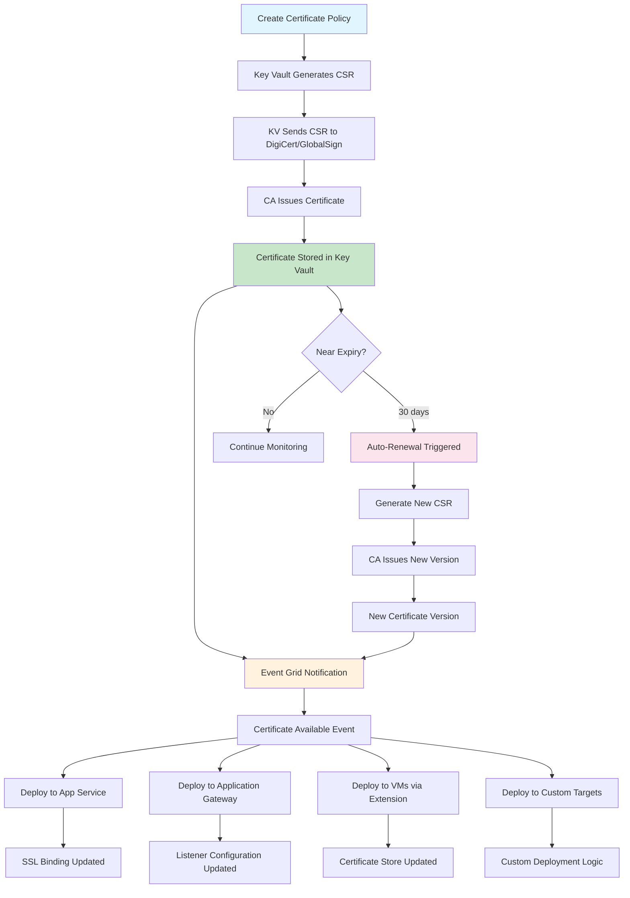
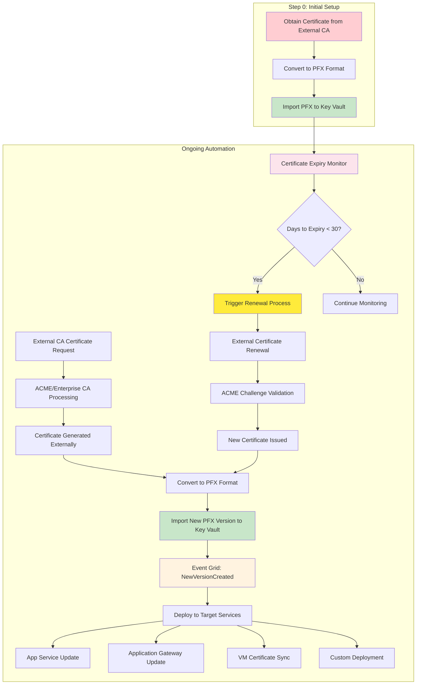
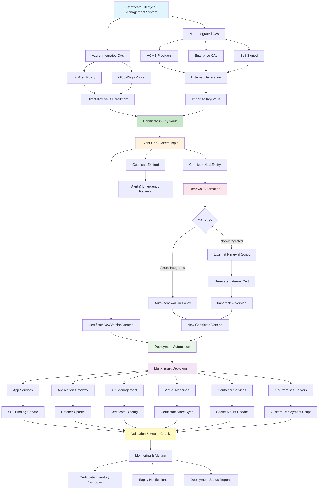
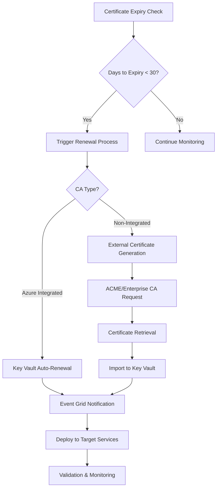
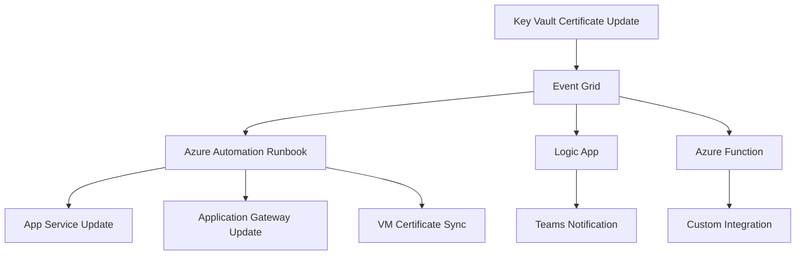

# Certificate Import Automation to Azure Key Vault

This document provides detailed guidance on automating certificate import to Azure Key Vault, covering different certificate authority scenarios and their respective automation strategies.

> 📖 **New to Integrated CA Certificate Generation?** 
> Check out our step-by-step guide: [**Integrated CA Certificate Generation**](./INTEGRATED_CA_CERTIFICATE_GENERATION.md) - explains how certificates are automatically generated without manual uploads.

## 📋 Table of Contents

<details>
<summary><strong>🔐 Azure-Integrated CAs (DigiCert, GlobalSign)</strong></summary>

- [Native Integration Benefits](#-native-integration-benefits)
- [Certificate Lifecycle Flow](#-certificate-lifecycle-flow)
- [Exception Cases for Import](#-exception-when-you-might-import-with-azure-integrated-cas)
- [Automation Approach](#-automation-approach)
  - [Policy-Based Certificate Creation](#1-policy-based-certificate-creation)
  - [Automated Renewal Configuration](#2-automated-renewal-configuration)
  - [Issuer Configuration](#3-issuer-configuration-one-time-setup)
- [Benefits & Limitations](#-benefits--limitations)
</details>

<details>
<summary><strong>🛠 Non-Azure-Integrated CAs (Self-signed, ACME, Enterprise CAs)</strong></summary>

- [Import-Based Automation Strategy](#-import-based-automation-strategy)
- [Non-Integrated CA Lifecycle Flow](#-non-integrated-ca-lifecycle-flow)
- [Automation Approaches](#-automation-approaches)
  - [ACME Protocol (Let's Encrypt, ZeroSSL)](#a-acme-protocol-lets-encrypt-zerossl-etc)
  - [PowerShell-Based Enterprise CA](#b-powershell-based-enterprise-ca-automation)
  - [Event-Driven with Azure Functions](#c-event-driven-automation-with-azure-functions)
- [Automation Patterns & Best Practices](#-automation-patterns--best-practices)
- [Certificate Source Integration Matrix](#3-certificate-source-integration-matrix)
</details>

<details>
<summary><strong>🚀 Certificate Deployment from Key Vault</strong></summary>

- [Azure-Native Services](#-azure-native-services-built-in-integration)
  - [App Service / Function Apps](#app-service--function-apps)
  - [Application Gateway](#application-gateway)
  - [Azure API Management](#azure-api-management)
- [Virtual Machines & On-Premises](#%EF%B8%8F-virtual-machines--on-premises-servers)
  - [Windows VMs - Key Vault Extension](#windows-vms---key-vault-extension)
  - [Linux VMs - Custom Scripts](#linux-vms---custom-scripts)
- [Automated Certificate Sync Solutions](#-automated-certificate-sync-solutions)
- [Deployment Method Comparison](#-deployment-method-comparison)
</details>

<details>
<summary><strong>🔗 Certificate Chain Management & Subdomains</strong></summary>

- [Certificate Chain Composition](#-certificate-chain-composition)
- [Subdomain Certificate Strategies](#-subdomain-certificate-strategies)
  - [Wildcard Certificates](#strategy-1-wildcard-certificates)
  - [Individual Subdomain Certificates](#strategy-2-individual-subdomain-certificates)
  - [Multi-Domain SAN Certificates](#strategy-3-multi-domain-san-certificates)
- [Certificate Chain Validation & Troubleshooting](#-certificate-chain-validation--troubleshooting)
- [Strategy Comparison](#-certificate-management-strategy-comparison)
</details>

<details>
<summary><strong>🔄 Event-Driven Architecture & Monitoring</strong></summary>

- [Event-Driven Renewal Architecture](#-event-driven-renewal-architecture)
- [Monitoring & Automation Workflow](#monitoring--automation-workflow)
- [Implementation Steps](#implementation-steps)
- [Security Considerations](#-security-considerations)
- [Sample Monitoring Scripts](#sample-monitoring-script)
- [Additional Azure CLI Utilities](#-additional-azure-cli-utilities)
</details>

---

## 📋 Overview

Certificate import automation varies significantly depending on the Certificate Authority (CA) type and integration level with Azure Key Vault. This guide covers two primary scenarios:

1. **Azure-Integrated CAs** (DigiCert, GlobalSign)
2. **Non-Azure-Integrated CAs** (Self-signed, ACME/Let's Encrypt, Enterprise CAs)

## 🎯 Quick Reference

| Scenario | Automation Level | Primary Method | Key Benefits |
|----------|------------------|----------------|--------------|
| **Azure-Integrated CAs** | 🟢 **High** | Native Key Vault integration | Auto-renewal, HSM protection, no import needed |
| **Non-Integrated CAs** | 🟡 **Medium** | External generation + import | Flexibility, cost savings, custom CA support |

> **💡 Pro Tip**: Use the collapsible sections below to navigate to specific implementation details. All code examples are provided in both **PowerShell** and **Azure CLI** formats.

---

## 🔐 Scenario 1: Azure-Integrated CAs (DigiCert, GlobalSign)

### ✅ Native Integration Benefits

Azure Key Vault has **native integration** with DigiCert and GlobalSign, providing:

- **Direct certificate enrollment** through Key Vault policies (no import needed)
- **Automatic renewal** via lifecycle actions  
- **CSR generation within Key Vault** - private keys never leave the HSM
- **End-to-end automation** without manual certificate handling

> **🔑 Key Point**: With Azure-integrated CAs, you typically **do NOT import/upload** certificates. Instead, Key Vault communicates directly with the CA to issue certificates internally.

### 🔄 Certificate Lifecycle Flow



### 📤 Exception: When You MIGHT Import with Azure-Integrated CAs

**Scenarios where import is still used:**

1. **Migration**: Moving existing DigiCert/GlobalSign certificates from other systems
2. **Legacy Certificates**: Certificates issued before Azure integration setup  
3. **Bulk Import**: When you have existing certificates issued outside Azure
4. **Emergency Situations**: When direct enrollment fails and you need immediate deployment

```bash
# Example: Importing existing DigiCert certificate during migration
az keyvault certificate import \
    --vault-name "your-keyvault" \
    --name "migrated-digicert-cert" \
    --file "existing-cert.pfx" \
    --password "pfx-password"
```

### 🚀 Automation Approach

#### 1. Policy-Based Certificate Creation

<details>
<summary><strong>📝 PowerShell Example</strong> (Click to expand)</summary>

```powershell
# Create certificate policy for DigiCert
$policy = New-AzKeyVaultCertificatePolicy `
    -IssuerName "DigiCert" `
    -SubjectName "CN=example.com" `
    -DnsName @("example.com", "*.example.com") `
    -ValidityInMonths 12 `
    -RenewAtPercentageLifetime 80 `
    -EmailAtPercentageLifetime @(80, 90) `
    -ReuseKeyOnRenewal $true

# Create certificate (triggers enrollment with DigiCert)
Add-AzKeyVaultCertificate `
    -VaultName "your-keyvault" `
    -Name "example-com-cert" `
    -CertificatePolicy $policy
```
</details>

<details>
<summary><strong>🖥️ Azure CLI Example</strong> (Click to expand)</summary>

```bash
# Create certificate policy JSON file
cat > cert-policy.json << 'EOF'
{
  "issuerParameters": {
    "name": "DigiCert"
  },
  "x509CertificateProperties": {
    "subject": "CN=example.com",
    "subjectAlternativeNames": {
      "dnsNames": ["example.com", "*.example.com"]
    },
    "validityInMonths": 12
  },
  "lifetimeActions": [
    {
      "trigger": {
        "lifetimePercentage": 80
      },
      "action": {
        "actionType": "AutoRenew"
      }
    },
    {
      "trigger": {
        "lifetimePercentage": 80
      },
      "action": {
        "actionType": "EmailContacts"
      }
    }
  ],
  "keyProperties": {
    "reuseKey": true,
    "keyType": "RSA",
    "keySize": 2048
  }
}
EOF

# Create certificate with policy
az keyvault certificate create \
    --vault-name "your-keyvault" \
    --name "example-com-cert" \
    --policy @cert-policy.json
```
</details>

#### 2. Automated Renewal Configuration

<details>
<summary><strong>📝 PowerShell Example</strong> (Click to expand)</summary>

```powershell
# Configure lifecycle actions for automatic renewal
$lifetimeAction = New-AzKeyVaultCertificateLifetimeAction `
    -Action "AutoRenew" `
    -PercentageLifetime 80

$policy = New-AzKeyVaultCertificatePolicy `
    -IssuerName "DigiCert" `
    -SubjectName "CN=example.com" `
    -DnsName @("example.com") `
    -ValidityInMonths 12 `
    -LifetimeAction $lifetimeAction
```
</details>

<details>
<summary><strong>🖥️ Azure CLI Example</strong> (Click to expand)</summary>

```bash
# Create policy with auto-renewal configuration
cat > auto-renew-policy.json << 'EOF'
{
  "issuerParameters": {
    "name": "DigiCert"
  },
  "x509CertificateProperties": {
    "subject": "CN=example.com",
    "subjectAlternativeNames": {
      "dnsNames": ["example.com"]
    },
    "validityInMonths": 12
  },
  "lifetimeActions": [
    {
      "trigger": {
        "lifetimePercentage": 80
      },
      "action": {
        "actionType": "AutoRenew"
      }
    }
  ],
  "keyProperties": {
    "reuseKey": true,
    "keyType": "RSA",
    "keySize": 2048
  }
}
EOF

# Update certificate policy
az keyvault certificate set-policy \
    --vault-name "your-keyvault" \
    --name "example-com-cert" \
    --policy @auto-renew-policy.json
```
</details>

#### 3. Issuer Configuration (One-time Setup)

<details>
<summary><strong>🖥️ Azure CLI Example</strong> (Click to expand)</summary>

```bash
# Configure DigiCert issuer in Key Vault
az keyvault certificate issuer create \
    --vault-name "your-keyvault" \
    --issuer-name "DigiCert" \
    --provider-name "DigiCert" \
    --account-id "your-digicert-account-id" \
    --password "your-api-key"
```
</details>

<details>
<summary><strong>📝 PowerShell Example</strong> (Click to expand)</summary>

```powershell
# Configure DigiCert issuer using PowerShell
Set-AzKeyVaultCertificateIssuer `
    -VaultName "your-keyvault" `
    -Name "DigiCert" `
    -IssuerProvider "DigiCert" `
    -AccountId "your-digicert-account-id" `
    -ApiKey "your-api-key"

# Alternative: Configure GlobalSign issuer
Set-AzKeyVaultCertificateIssuer `
    -VaultName "your-keyvault" `
    -Name "GlobalSign" `
    -IssuerProvider "GlobalSign" `
    -AccountId "your-globalsign-account-id" `
    -ApiKey "your-api-key"
```
</details>

### 📊 Benefits & Limitations

| Aspect | Benefit | Limitation |
|--------|---------|------------|
| **Security** | Private keys never leave Key Vault HSM | Requires DigiCert/GlobalSign account |
| **Automation** | Fully automated renewal | Limited to supported CAs only |
| **Management** | Single pane of glass in Azure | Higher cost than some alternatives |
| **Compliance** | FIPS 140-2 Level 2 HSM protection | Vendor lock-in to Azure ecosystem |

---

## 🛠 Scenario 2: Non-Azure-Integrated CAs

### 🔄 Import-Based Automation Strategy

For CAs not natively integrated with Azure (self-signed, ACME, Enterprise CAs), automation requires:

**🔑 Step 0: Initial Certificate Import (Prerequisites)**
- **Obtain certificate from external CA** (manually or via existing process)
- **Import certificate to Azure Key Vault** (establish baseline)
- **Verify certificate is accessible** for automation

**🔄 Ongoing Automation Steps:**
1. **External certificate generation/renewal**
2. **Secure certificate retrieval**
3. **Automated import to Key Vault**
4. **Version management and deployment**

> 📌 **Important**: Unlike integrated CAs, you must **first import an existing certificate** to Key Vault before automation can manage renewals.

### 📊 Non-Integrated CA Lifecycle Flow



### � Step 0: Initial Certificate Import (Prerequisites)

Before automation can begin, you must first obtain and import an existing certificate to Azure Key Vault:

> 🔑 **Critical Requirement**: Azure Key Vault **ONLY accepts certificates in PFX (PKCS#12) format**. All other formats (PEM, CRT, CER, etc.) must be converted to PFX before import.

#### **Scenario 1: You Already Have a PFX Certificate**

```bash
# Direct import if you have PFX format
az keyvault certificate import \
    --vault-name "your-keyvault" \
    --name "example-com-cert" \
    --file "certificate.pfx" \
    --password "pfx-password"
```

#### **Scenario 2: You Have PEM/CRT Files (Conversion Required)**

```bash
# STEP 1: Convert PEM files to PFX format (REQUIRED)
openssl pkcs12 -export \
    -out certificate.pfx \
    -inkey private.key \
    -in certificate.crt \
    -certfile ca-bundle.crt \
    -password pass:YourPFXPassword

# STEP 2: Import PFX to Key Vault
az keyvault certificate import \
    --vault-name "your-keyvault" \
    --name "example-com-cert" \
    --file "certificate.pfx" \
    --password "YourPFXPassword"
```

#### **Scenario 3: Generate and Convert Let's Encrypt Certificate**

```bash
#!/bin/bash
# Generate initial Let's Encrypt certificate and convert to PFX
DOMAIN="example.com"
EMAIL="admin@example.com"

# Generate certificate using certbot (creates PEM files)
certbot certonly \
    --standalone \
    --email "$EMAIL" \
    --agree-tos \
    --non-interactive \
    --domain "$DOMAIN"

# REQUIRED: Convert Let's Encrypt PEM files to PFX format
CERT_PATH="/etc/letsencrypt/live/$DOMAIN"
PFX_PASSWORD=$(openssl rand -base64 32)

openssl pkcs12 -export \
    -out "${DOMAIN}.pfx" \
    -inkey "$CERT_PATH/privkey.pem" \
    -in "$CERT_PATH/cert.pem" \
    -certfile "$CERT_PATH/chain.pem" \
    -password "pass:$PFX_PASSWORD"

# Import PFX to Azure Key Vault
az keyvault certificate import \
    --vault-name "your-keyvault" \
    --name "example-com-cert" \
    --file "${DOMAIN}.pfx" \
    --password "$PFX_PASSWORD"

echo "✅ Certificate converted to PFX and imported to Key Vault"
```

#### **Common Certificate Format Conversions to PFX**

```bash
# From separate certificate and key files
openssl pkcs12 -export \
    -out certificate.pfx \
    -inkey private.key \
    -in certificate.crt \
    -password pass:YourPassword

# From certificate with intermediate chain
openssl pkcs12 -export \
    -out certificate.pfx \
    -inkey private.key \
    -in certificate.crt \
    -certfile intermediate.crt \
    -password pass:YourPassword

# From full chain certificate
openssl pkcs12 -export \
    -out certificate.pfx \
    -inkey private.key \
    -in fullchain.crt \
    -password pass:YourPassword

# From DER format certificate
openssl pkcs12 -export \
    -out certificate.pfx \
    -inkey private.key \
    -in certificate.der \
    -inform DER \
    -password pass:YourPassword
```

#### **Verify Import Success**

```bash
# Check certificate was imported successfully
az keyvault certificate show \
    --vault-name "your-keyvault" \
    --name "example-com-cert" \
    --query "{Name:name, Subject:policy.x509CertificateProperties.subject, ValidFrom:attributes.notBefore, ValidTo:attributes.expires, Thumbprint:x509Thumbprint}" \
    --output table

# Set up certificate for automation (no policy needed for imported certs)
echo "Certificate ready for automation workflows"
```

> ⚠️ **Critical**: Imported certificates do **not** have auto-renewal policies. You must implement external renewal automation as shown in the sections below.

### �🚀 Automation Approaches

#### A. ACME Protocol (Let's Encrypt, ZeroSSL, etc.)

<details>
<summary><strong>🐧 Bash with Azure CLI</strong> (Click to expand)</summary>

```bash
#!/bin/bash
# ACME certificate automation with certbot and Azure CLI

DOMAIN="example.com"
VAULT_NAME="your-keyvault"
CERT_NAME="example-com-cert"

# 1. Generate/renew certificate using certbot
certbot certonly \
    --dns-cloudflare \
    --dns-cloudflare-credentials ~/.secrets/cloudflare.ini \
    --email admin@example.com \
    --agree-tos \
    --non-interactive \
    --domain ${DOMAIN} \
    --domain "*.${DOMAIN}"

# 2. Convert to PFX format
CERT_PATH="/etc/letsencrypt/live/${DOMAIN}"
PFX_PASSWORD=$(openssl rand -base64 32)
PFX_FILE="${CERT_PATH}/certificate.pfx"

openssl pkcs12 -export \
    -out "${PFX_FILE}" \
    -inkey "${CERT_PATH}/privkey.pem" \
    -in "${CERT_PATH}/fullchain.pem" \
    -password "pass:${PFX_PASSWORD}"

# 3. Import to Key Vault using Azure CLI
az keyvault certificate import \
    --vault-name "${VAULT_NAME}" \
    --name "${CERT_NAME}" \
    --file "${PFX_FILE}" \
    --password "${PFX_PASSWORD}"

# 4. Store PFX password as a secret for future reference
az keyvault secret set \
    --vault-name "${VAULT_NAME}" \
    --name "${CERT_NAME}-password" \
    --value "${PFX_PASSWORD}"

# 5. Cleanup temporary files
rm -f "${PFX_FILE}"

echo "Certificate imported successfully to Key Vault: ${VAULT_NAME}"
```
</details>

<details>
<summary><strong>📝 PowerShell Alternative</strong> (Click to expand)</summary>

```powershell
# PowerShell ACME automation with Posh-ACME module
param(
    [string]$Domain = "example.com",
    [string]$VaultName = "your-keyvault",
    [string]$CertName = "example-com-cert"
)

# Install Posh-ACME if not present
if (-not (Get-Module -ListAvailable -Name Posh-ACME)) {
    Install-Module -Name Posh-ACME -Force -Scope CurrentUser
}

Import-Module Posh-ACME

# 1. Set up ACME server (Let's Encrypt)
Set-PAServer LE_PROD

# 2. Create new certificate order
$certParams = @{
    Domain = @($Domain, "*.$Domain")
    Contact = "admin@example.com"
    DnsPlugin = "Cloudflare"
    PluginArgs = @{
        CFToken = $env:CLOUDFLARE_API_TOKEN
        CFTokenInsecure = $true
    }
    AcceptTOS = $true
}

$cert = New-PACertificate @certParams

# 3. Convert to PFX and import to Key Vault
$pfxPassword = ConvertTo-SecureString -String ([System.Guid]::NewGuid().ToString()) -AsPlainText -Force

Import-AzKeyVaultCertificate `
    -VaultName $VaultName `
    -Name $CertName `
    -FilePath $cert.PfxFullChain `
    -Password $pfxPassword

Write-Host "Certificate imported successfully to Key Vault: $VaultName"
```
</details>

#### B. PowerShell-Based Enterprise CA Automation

```powershell
# Enterprise CA certificate request and import automation
param(
    [string]$VaultName,
    [string]$CertificateName,
    [string]$SubjectName,
    [string[]]$DnsNames,
    [string]$CAServer,
    [string]$CATemplate = "WebServer"
)

# 1. Generate CSR
$cert = New-SelfSignedCertificate `
    -Subject $SubjectName `
    -DnsName $DnsNames `
    -KeyAlgorithm RSA `
    -KeyLength 2048 `
    -CertStoreLocation "Cert:\CurrentUser\My" `
    -KeyExportPolicy Exportable `
    -NotAfter (Get-Date).AddDays(1)  # Temporary cert for CSR

$csr = [System.Convert]::ToBase64String($cert.GetCertificationRequest())

# 2. Submit to Enterprise CA
$caConfig = "$CAServer\$((Get-CACertificate -ComputerName $CAServer)[0].Name)"
$request = certreq -new -config $caConfig -template $CATemplate -

# 3. Wait for issuance and retrieve
Start-Sleep -Seconds 30
$issuedCert = certreq -retrieve -config $caConfig $requestId

# 4. Export as PFX
$pfxPassword = ConvertTo-SecureString -String (New-Guid).Guid -AsPlainText -Force
$pfxPath = "$env:TEMP\$CertificateName.pfx"
Export-PfxCertificate -Cert $issuedCert -FilePath $pfxPath -Password $pfxPassword

# 5. Import to Key Vault
Import-AzKeyVaultCertificate `
    -VaultName $VaultName `
    -Name $CertificateName `
    -FilePath $pfxPath `
    -Password $pfxPassword

# Cleanup
Remove-Item $pfxPath -Force
```

#### C. Event-Driven Automation with Azure Functions

```csharp
// Azure Function for ACME certificate automation
[FunctionName("ACMECertificateRenewal")]
public static async Task<IActionResult> Run(
    [TimerTrigger("0 0 2 * * *")] TimerInfo myTimer,  // Daily at 2 AM
    ILogger log)
{
    var certbotClient = new CertbotClient();
    var keyVaultClient = new KeyVaultClient();
    
    // 1. Check certificate expiry
    var daysToExpiry = await CheckCertificateExpiry("example.com");
    
    if (daysToExpiry <= 30)
    {
        // 2. Request renewal via ACME
        var certificateResult = await certbotClient.RenewCertificateAsync(
            domain: "example.com",
            challengeType: "dns-01",
            dnsProvider: "cloudflare"
        );
        
        // 3. Import to Key Vault
        await keyVaultClient.ImportCertificateAsync(
            vaultBaseUrl: "https://your-keyvault.vault.azure.net/",
            certificateName: "example-com-cert",
            certificateBundle: certificateResult.ToPfx(),
            certificatePolicy: null
        );
        
        log.LogInformation("Certificate renewed and imported successfully");
    }
    
    return new OkResult();
}
```

### 🔧 Automation Patterns & Best Practices

#### 1. Secure Credential Management

```yaml
# Azure DevOps Pipeline example
trigger:
  schedules:
  - cron: "0 2 * * *"  # Daily at 2 AM
    displayName: Daily certificate check
    branches:
      include:
      - main

variables:
- group: certificate-secrets  # Contains ACME credentials

steps:
- task: AzureCLI@2
  displayName: 'Renew ACME Certificates'
  inputs:
    azureSubscription: 'Azure Service Connection'
    scriptType: 'bash'
    scriptLocation: 'inlineScript'
    inlineScript: |
      # Set up credentials from variable group
      export CLOUDFLARE_EMAIL=$(CLOUDFLARE_EMAIL)
      export CLOUDFLARE_API_KEY=$(CLOUDFLARE_API_KEY)
      
      # Run renewal script
      ./scripts/renew-acme-certificates.sh
```

#### 2. Multi-Environment Certificate Management

**PowerShell:**
```powershell
# Multi-environment certificate deployment
$environments = @(
    @{ Name = "dev"; VaultName = "kv-dev-001"; Domains = @("dev.example.com") },
    @{ Name = "staging"; VaultName = "kv-staging-001"; Domains = @("staging.example.com") },
    @{ Name = "prod"; VaultName = "kv-prod-001"; Domains = @("example.com", "*.example.com") }
)

foreach ($env in $environments) {
    Write-Host "Processing environment: $($env.Name)"
    
    # Generate environment-specific certificate
    $cert = Request-ACMECertificate -Domains $env.Domains
    
    # Import to environment-specific Key Vault
    Import-AzKeyVaultCertificate `
        -VaultName $env.VaultName `
        -Name "ssl-certificate" `
        -FilePath $cert.PfxPath `
        -Password $cert.Password
}
```

**Azure CLI (Bash):**
```bash
#!/bin/bash
# Multi-environment certificate deployment using Azure CLI

declare -A environments=(
    ["dev"]="kv-dev-001:dev.example.com"
    ["staging"]="kv-staging-001:staging.example.com" 
    ["prod"]="kv-prod-001:example.com,*.example.com"
)

for env_name in "${!environments[@]}"; do
    IFS=':' read -r vault_name domains <<< "${environments[$env_name]}"
    echo "Processing environment: $env_name"
    echo "Vault: $vault_name, Domains: $domains"
    
    # Convert comma-separated domains to array
    IFS=',' read -ra domain_array <<< "$domains"
    
    # Build certbot domain arguments
    domain_args=""
    for domain in "${domain_array[@]}"; do
        domain_args+=" --domain $domain"
    done
    
    # Generate certificate using certbot
    certbot certonly \
        --dns-cloudflare \
        --dns-cloudflare-credentials ~/.secrets/cloudflare.ini \
        --email admin@example.com \
        --agree-tos \
        --non-interactive \
        $domain_args \
        --cert-name "$env_name-ssl-cert"
    
    # Convert to PFX
    cert_path="/etc/letsencrypt/live/$env_name-ssl-cert"
    pfx_password=$(openssl rand -base64 32)
    pfx_file="/tmp/$env_name-ssl-cert.pfx"
    
    openssl pkcs12 -export \
        -out "$pfx_file" \
        -inkey "$cert_path/privkey.pem" \
        -in "$cert_path/fullchain.pem" \
        -password "pass:$pfx_password"
    
    # Import to Key Vault
    az keyvault certificate import \
        --vault-name "$vault_name" \
        --name "ssl-certificate" \
        --file "$pfx_file" \
        --password "$pfx_password"
    
    # Store password as secret
    az keyvault secret set \
        --vault-name "$vault_name" \
        --name "ssl-certificate-password" \
        --value "$pfx_password"
    
    # Cleanup
    rm -f "$pfx_file"
    
    echo "Certificate deployed to environment: $env_name"
done
```

#### 3. Certificate Source Integration Matrix

| CA Type | Automation Method | Complexity | Security | Cost |
|---------|------------------|------------|----------|------|
| **Let's Encrypt** | ACME + certbot | Medium | High | Free |
| **ZeroSSL** | ACME + API | Medium | High | Low |
| **DigiCert** | Native Azure | Low | Highest | High |
| **GlobalSign** | Native Azure | Low | Highest | High |
| **Enterprise CA** | PowerShell + certreq | High | High | Variable |
| **Self-Signed** | PowerShell + OpenSSL | Low | Medium | Free |

---

## 🔄 Event-Driven Renewal Architecture

### Comprehensive Certificate Lifecycle Management



### Monitoring & Automation Workflow



### Implementation Steps

1. **Set up monitoring** (Azure Monitor, custom scripts, or third-party tools)
2. **Configure renewal triggers** (Azure Automation, Azure Functions, or CI/CD pipelines)
3. **Implement certificate generation** (ACME clients, CA APIs, or PowerShell scripts)
4. **Automate Key Vault import** (Azure CLI, PowerShell, or REST API)
5. **Deploy to target services** (App Service, Application Gateway, etc.)

---

## 🛡 Security Considerations

### Key Protection Strategies

| Scenario | Private Key Handling | Security Level | Recommendations |
|----------|---------------------|----------------|-----------------|
| **Azure Integrated** | Never leaves HSM | Highest | ✅ Preferred for production |
| **ACME Import** | Temporary exposure | High | 🔄 Minimize exposure time |
| **Enterprise CA** | Managed externally | Variable | 🔐 Secure transfer protocols |

### Best Practices

1. **Rotate import credentials** regularly
2. **Use secure channels** (HTTPS, encrypted storage) for certificate transfer
3. **Implement audit logging** for all certificate operations
4. **Monitor certificate inventory** and expiration dates
5. **Test renewal processes** in non-production environments

---

## 📈 Monitoring & Alerting

### Key Metrics to Track

- Certificate expiry dates (30, 14, 7, 1 days before)
- Renewal success/failure rates
- Import operation latency
- Certificate deployment status
- ACME challenge success rates

### Sample Monitoring Script

<details>
<summary><strong>📝 PowerShell Monitoring</strong> (Click to expand)</summary>

```powershell
# Certificate expiry monitoring
$vaults = @("kv-prod-001", "kv-staging-001", "kv-dev-001")
$expiryThresholds = @(30, 14, 7, 1)

foreach ($vault in $vaults) {
    $certificates = Get-AzKeyVaultCertificate -VaultName $vault
    
    foreach ($cert in $certificates) {
        $daysToExpiry = ($cert.Expires - (Get-Date)).Days
        
        if ($daysToExpiry -in $expiryThresholds) {
            Send-AlertNotification -Message "Certificate $($cert.Name) expires in $daysToExpiry days"
        }
    }
}
```
</details>

<details>
<summary><strong>🐧 Azure CLI Monitoring (Bash)</strong> (Click to expand)</summary>
```bash
#!/bin/bash
# Certificate expiry monitoring using Azure CLI

VAULTS=("kv-prod-001" "kv-staging-001" "kv-dev-001")
EXPIRY_THRESHOLDS=(30 14 7 1)

send_alert() {
    local message="$1"
    echo "ALERT: $message"
    # Add your alerting mechanism here (email, webhook, etc.)
    # Example: curl -X POST "$WEBHOOK_URL" -d "{\"text\":\"$message\"}"
}

check_certificate_expiry() {
    local vault_name="$1"
    local cert_name="$2"
    
    # Get certificate expiry date
    local expires_date=$(az keyvault certificate show \
        --vault-name "$vault_name" \
        --name "$cert_name" \
        --query "attributes.expires" \
        --output tsv)
    
    if [[ -n "$expires_date" ]]; then
        # Convert to Unix timestamp
        local expires_epoch=$(date -d "$expires_date" +%s)
        local current_epoch=$(date +%s)
        local days_to_expiry=$(( (expires_epoch - current_epoch) / 86400 ))
        
        # Check if within threshold
        for threshold in "${EXPIRY_THRESHOLDS[@]}"; do
            if [[ $days_to_expiry -eq $threshold ]]; then
                send_alert "Certificate $cert_name in vault $vault_name expires in $days_to_expiry days"
                break
            fi
        done
        
        echo "Certificate: $cert_name, Days to expiry: $days_to_expiry"
    fi
}

# Main monitoring loop
for vault in "${VAULTS[@]}"; do
    echo "Checking certificates in vault: $vault"
    
    # Get all certificates in the vault
    certificates=$(az keyvault certificate list \
        --vault-name "$vault" \
        --query "[].name" \
        --output tsv)
    
    # Check each certificate
    while IFS= read -r cert_name; do
        if [[ -n "$cert_name" ]]; then
            check_certificate_expiry "$vault" "$cert_name"
        fi
    done <<< "$certificates"
    
    echo "---"
done
```

**Enhanced Monitoring with JSON Output:**
```bash
#!/bin/bash
# Advanced certificate monitoring with JSON reporting

generate_certificate_report() {
    local vault_name="$1"
    local output_file="cert-report-$(date +%Y%m%d).json"
    
    echo "Generating certificate report for vault: $vault_name"
    
    # Get detailed certificate information
    az keyvault certificate list \
        --vault-name "$vault_name" \
        --include-pending false \
        --query '[].{
            name: name,
            enabled: attributes.enabled,
            expires: attributes.expires,
            created: attributes.created,
            updated: attributes.updated,
            issuer: policy.issuerParameters.name,
            keyType: policy.keyProperties.keyType,
            keySize: policy.keyProperties.keySize,
            subject: policy.x509CertificateProperties.subject,
            dnsNames: policy.x509CertificateProperties.subjectAlternativeNames.dnsNames
        }' > "$output_file"
    
    echo "Report saved to: $output_file"
}

# Generate reports for all vaults
for vault in "${VAULTS[@]}"; do
    generate_certificate_report "$vault"
done
```

---

## 🛠 Additional Azure CLI Utilities

### Certificate Management Commands

**List All Certificates Across Multiple Vaults:**
```bash
#!/bin/bash
# List certificates across all Key Vaults in subscription

SUBSCRIPTION_ID=$(az account show --query id --output tsv)

echo "Certificate inventory for subscription: $SUBSCRIPTION_ID"
echo "================================================="

# Get all Key Vaults in subscription
vaults=$(az keyvault list --query "[].name" --output tsv)

while IFS= read -r vault_name; do
    if [[ -n "$vault_name" ]]; then
        echo "Vault: $vault_name"
        echo "-------------------"
        
        # List certificates with key details
        az keyvault certificate list \
            --vault-name "$vault_name" \
            --query "[].{Name:name, Enabled:attributes.enabled, Expires:attributes.expires}" \
            --output table
        echo ""
    fi
done <<< "$vaults"
```

**Bulk Certificate Operations:**
```bash
#!/bin/bash
# Bulk certificate operations using Azure CLI

bulk_enable_certificates() {
    local vault_name="$1"
    
    echo "Enabling all certificates in vault: $vault_name"
    
    cert_names=$(az keyvault certificate list \
        --vault-name "$vault_name" \
        --query "[?attributes.enabled==\`false\`].name" \
        --output tsv)
    
    while IFS= read -r cert_name; do
        if [[ -n "$cert_name" ]]; then
            echo "Enabling certificate: $cert_name"
            az keyvault certificate set-attributes \
                --vault-name "$vault_name" \
                --name "$cert_name" \
                --enabled true
        fi
    done <<< "$cert_names"
}

bulk_backup_certificates() {
    local vault_name="$1"
    local backup_dir="./cert-backups/$(date +%Y%m%d)"
    
    mkdir -p "$backup_dir"
    
    echo "Backing up certificates from vault: $vault_name"
    
    cert_names=$(az keyvault certificate list \
        --vault-name "$vault_name" \
        --query "[].name" \
        --output tsv)
    
    while IFS= read -r cert_name; do
        if [[ -n "$cert_name" ]]; then
            echo "Backing up certificate: $cert_name"
            az keyvault certificate backup \
                --vault-name "$vault_name" \
                --name "$cert_name" \
                --file "$backup_dir/${cert_name}.backup"
        fi
    done <<< "$cert_names"
    
    echo "Backup completed. Files saved to: $backup_dir"
}

# Usage examples
# bulk_enable_certificates "your-keyvault"
# bulk_backup_certificates "your-keyvault"
```

### Azure CLI vs PowerShell Comparison

| Operation | Azure CLI | PowerShell | Notes |
|-----------|-----------|------------|-------|
| **Authentication** | `az login` | `Connect-AzAccount` | Both support service principals |
| **Certificate Creation** | `az keyvault certificate create` | `Add-AzKeyVaultCertificate` | JSON policy vs Object policy |
| **Certificate Import** | `az keyvault certificate import` | `Import-AzKeyVaultCertificate` | Similar syntax and capabilities |
| **Batch Operations** | Bash loops + `az` | PowerShell pipelines | Bash better for simple scripts |
| **JSON Handling** | Native JMESPath | ConvertFrom-Json | CLI has better JSON querying |
| **Error Handling** | Exit codes + stderr | Try-Catch blocks | PowerShell more sophisticated |
| **Cross-Platform** | ✅ Native | ✅ PowerShell Core | Both work on Linux/Windows |

### Advanced Azure CLI Certificate Workflows

**Certificate Renewal Check with Notification:**
```bash
#!/bin/bash
# Advanced renewal check with multiple notification channels

CONFIG_FILE="./cert-config.json"

# Create configuration file if it doesn't exist
if [[ ! -f "$CONFIG_FILE" ]]; then
    cat > "$CONFIG_FILE" << 'EOF'
{
  "vaults": [
    {
      "name": "kv-prod-001",
      "environment": "production",
      "alerting": {
        "email": "admin@example.com",
        "webhook": "https://hooks.slack.com/...",
        "teams": "https://outlook.office.com/webhook/..."
      }
    }
  ],
  "thresholds": {
    "critical": 7,
    "warning": 30,
    "info": 90
  }
}
EOF
    echo "Created default configuration file: $CONFIG_FILE"
fi

send_notification() {
    local severity="$1"
    local message="$2"
    local webhook_url="$3"
    
    case "$severity" in
        "critical")
            color="danger"
            ;;
        "warning") 
            color="warning"
            ;;
        "info")
            color="good"
            ;;
        *)
            color="good"
            ;;
    esac
    
    # Send Slack notification
    if [[ -n "$webhook_url" ]]; then
        curl -X POST "$webhook_url" \
            -H 'Content-type: application/json' \
            --data "{
                \"attachments\": [{
                    \"color\": \"$color\",
                    \"title\": \"Certificate Alert - $severity\",
                    \"text\": \"$message\",
                    \"ts\": $(date +%s)
                }]
            }"
    fi
    
    echo "[$severity] $message"
}

check_certificates() {
    local vault_config="$1"
    local vault_name=$(echo "$vault_config" | jq -r '.name')
    local webhook_url=$(echo "$vault_config" | jq -r '.alerting.webhook // empty')
    
    echo "Checking certificates in vault: $vault_name"
    
    # Get certificates with expiry information
    certificates=$(az keyvault certificate list \
        --vault-name "$vault_name" \
        --query "[].{name:name, expires:attributes.expires}" \
        --output json)
    
    echo "$certificates" | jq -r '.[] | @base64' | while IFS= read -r cert_data; do
        cert_info=$(echo "$cert_data" | base64 -d)
        cert_name=$(echo "$cert_info" | jq -r '.name')
        expires_date=$(echo "$cert_info" | jq -r '.expires')
        
        if [[ "$expires_date" != "null" && -n "$expires_date" ]]; then
            expires_epoch=$(date -d "$expires_date" +%s)
            current_epoch=$(date +%s)
            days_to_expiry=$(( (expires_epoch - current_epoch) / 86400 ))
            
            # Read thresholds from config
            critical_threshold=$(jq -r '.thresholds.critical' "$CONFIG_FILE")
            warning_threshold=$(jq -r '.thresholds.warning' "$CONFIG_FILE")
            
            if [[ $days_to_expiry -le $critical_threshold ]]; then
                send_notification "critical" \
                    "Certificate '$cert_name' in vault '$vault_name' expires in $days_to_expiry days!" \
                    "$webhook_url"
            elif [[ $days_to_expiry -le $warning_threshold ]]; then
                send_notification "warning" \
                    "Certificate '$cert_name' in vault '$vault_name' expires in $days_to_expiry days" \
                    "$webhook_url"
            fi
        fi
    done
}

# Main execution
echo "Starting certificate expiry check..."

jq -r '.vaults[] | @base64' "$CONFIG_FILE" | while IFS= read -r vault_data; do
    vault_config=$(echo "$vault_data" | base64 -d)
    check_certificates "$vault_config"
done

echo "Certificate check completed."
```

---

## 🚀 Certificate Deployment from Key Vault to Target Services

Once certificates are stored in Azure Key Vault (either through native integration or import), target servers and services need to retrieve and install them. Azure provides several mechanisms for this:

### 📱 Azure-Native Services (Built-in Integration)

#### App Service / Function Apps
**Azure App Service has native Key Vault integration:**

> **🔑 Important**: The certificate in Key Vault must include the **complete certificate chain** (server cert + intermediate CA certs). Azure App Service automatically handles the chain validation when importing from Key Vault.

```bash
# First, add custom domain to the App Service
az webapp config hostname add \
    --webapp-name "my-webapp" \
    --resource-group "my-rg" \
    --hostname "subdomain.example.com"

# Link App Service to Key Vault certificate (must match domain/subdomain)
az webapp config ssl bind \
    --certificate-source "KeyVault" \
    --certificate-name "subdomain-example-com-cert" \
    --name "my-webapp" \
    --resource-group "my-rg" \
    --ssl-type "SNI"

# Configure App Service to auto-sync certificate updates
az webapp config appsettings set \
    --name "my-webapp" \
    --resource-group "my-rg" \
    --settings WEBSITE_LOAD_CERTIFICATES="*"
```

**Multi-Subdomain Certificate Management:**
```bash
# For wildcard certificates (*.example.com)
az webapp config ssl bind \
    --certificate-source "KeyVault" \
    --certificate-name "wildcard-example-com-cert" \
    --name "api-webapp" \
    --resource-group "my-rg" \
    --ssl-type "SNI"

az webapp config ssl bind \
    --certificate-source "KeyVault" \
    --certificate-name "wildcard-example-com-cert" \
    --name "admin-webapp" \
    --resource-group "my-rg" \
    --ssl-type "SNI"

# For individual subdomain certificates
az webapp config ssl bind \
    --certificate-source "KeyVault" \
    --certificate-name "api-example-com-cert" \
    --name "api-webapp" \
    --resource-group "my-rg" \
    --ssl-type "SNI"
```

**PowerShell:**
```powershell
# Import certificate from Key Vault to App Service
$cert = Import-AzWebAppKeyVaultCertificate `
    -ResourceGroupName "my-rg" `
    -WebAppName "my-webapp" `
    -KeyVaultName "my-keyvault" `
    -CertificateName "example-com-cert"

# Bind certificate to custom domain
New-AzWebAppSSLBinding `
    -ResourceGroupName "my-rg" `
    -WebAppName "my-webapp" `
    -Name "example.com" `
    -Thumbprint $cert.Thumbprint `
    -SSLState "SniEnabled"
```

#### Application Gateway
```bash
# Configure Application Gateway to use Key Vault certificate
az network application-gateway ssl-cert create \
    --gateway-name "my-appgw" \
    --resource-group "my-rg" \
    --name "ssl-cert" \
    --key-vault-secret-id "https://my-keyvault.vault.azure.net/secrets/example-com-cert"

# Update listener to use the certificate
az network application-gateway http-listener update \
    --gateway-name "my-appgw" \
    --resource-group "my-rg" \
    --name "https-listener" \
    --ssl-cert "ssl-cert"
```

#### Azure API Management
```bash
# Upload certificate to API Management from Key Vault
az apim certificate create \
    --service-name "my-apim" \
    --resource-group "my-rg" \
    --certificate-id "ssl-certificate" \
    --key-vault-secret-id "https://my-keyvault.vault.azure.net/secrets/example-com-cert"
```

### 🖥️ Virtual Machines & On-Premises Servers

#### Windows VMs - Key Vault Extension
```json
{
  "type": "Microsoft.Compute/virtualMachines/extensions",
  "apiVersion": "2019-12-01",
  "name": "[concat(variables('vmName'), '/KeyVaultExtension')]",
  "properties": {
    "publisher": "Microsoft.Azure.KeyVault",
    "type": "KeyVaultForWindows",
    "typeHandlerVersion": "1.0",
    "autoUpgradeMinorVersion": true,
    "settings": {
      "secretsManagementSettings": {
        "pollingIntervalInS": "3600",
        "certificateStoreName": "MY",
        "certificateStoreLocation": "LocalMachine",
        "observedCertificates": [
          {
            "url": "https://my-keyvault.vault.azure.net/secrets/example-com-cert",
            "certificateStoreName": "MY",
            "certificateStoreLocation": "LocalMachine"
          }
        ]
      }
    }
  }
}
```

**PowerShell Script for Windows Servers:**
```powershell
# Download and install certificate from Key Vault
param(
    [string]$VaultName = "my-keyvault",
    [string]$CertificateName = "example-com-cert",
    [string]$StoreLocation = "LocalMachine",
    [string]$StoreName = "My"
)

# Authenticate using Managed Identity or Service Principal
Connect-AzAccount -Identity

# Get certificate from Key Vault
$cert = Get-AzKeyVaultSecret -VaultName $VaultName -Name $CertificateName
$certBytes = [System.Convert]::FromBase64String($cert.SecretValueText)

# Install certificate to Windows Certificate Store
$certStore = New-Object System.Security.Cryptography.X509Certificates.X509Store($StoreName, $StoreLocation)
$certStore.Open([System.Security.Cryptography.X509Certificates.OpenFlags]::ReadWrite)

$x509cert = New-Object System.Security.Cryptography.X509Certificates.X509Certificate2($certBytes, "", [System.Security.Cryptography.X509Certificates.X509KeyStorageFlags]::MachineKeySet)
$certStore.Add($x509cert)
$certStore.Close()

Write-Host "Certificate installed successfully. Thumbprint: $($x509cert.Thumbprint)"

# Update IIS binding (if applicable)
if (Get-Module -ListAvailable -Name WebAdministration) {
    Import-Module WebAdministration
    
    # Remove old binding
    Remove-WebBinding -Name "Default Web Site" -Port 443 -Protocol "https" -ErrorAction SilentlyContinue
    
    # Add new binding with updated certificate
    New-WebBinding -Name "Default Web Site" -Port 443 -Protocol "https" -SslFlags 1
    
    # Bind certificate to HTTPS binding
    $binding = Get-WebBinding -Name "Default Web Site" -Port 443 -Protocol "https"
    $binding.AddSslCertificate($x509cert.Thumbprint, "My")
    
    Write-Host "IIS binding updated successfully"
}
```

#### Linux VMs - Custom Scripts
```bash
#!/bin/bash
# Download and install certificate from Key Vault on Linux

VAULT_NAME="my-keyvault"
CERT_NAME="example-com-cert"
CERT_PATH="/etc/ssl/certs"
KEY_PATH="/etc/ssl/private"

# Authenticate using Managed Identity
az login --identity

# Get certificate from Key Vault as PFX
az keyvault secret download \
    --vault-name "$VAULT_NAME" \
    --name "$CERT_NAME" \
    --encoding base64 \
    --file "/tmp/${CERT_NAME}.pfx.b64"

# Decode base64
base64 -d "/tmp/${CERT_NAME}.pfx.b64" > "/tmp/${CERT_NAME}.pfx"

# Extract certificate and private key (assuming no password or password stored separately)
# Get password from Key Vault if stored
PFX_PASSWORD=$(az keyvault secret show \
    --vault-name "$VAULT_NAME" \
    --name "${CERT_NAME}-password" \
    --query "value" \
    --output tsv 2>/dev/null || echo "")

if [[ -n "$PFX_PASSWORD" ]]; then
    PASSWORD_ARGS="-passin pass:$PFX_PASSWORD"
else
    PASSWORD_ARGS="-nodes"
fi

# Extract certificate
openssl pkcs12 -in "/tmp/${CERT_NAME}.pfx" \
    -clcerts -nokeys \
    $PASSWORD_ARGS \
    -out "${CERT_PATH}/${CERT_NAME}.crt"

# Extract private key
openssl pkcs12 -in "/tmp/${CERT_NAME}.pfx" \
    -nocerts \
    $PASSWORD_ARGS \
    -out "${KEY_PATH}/${CERT_NAME}.key"

# Set proper permissions
chmod 644 "${CERT_PATH}/${CERT_NAME}.crt"
chmod 600 "${KEY_PATH}/${CERT_NAME}.key"

# Update Nginx configuration (example)
if command -v nginx > /dev/null; then
    cat > "/etc/nginx/sites-available/ssl-site" << EOF
server {
    listen 443 ssl;
    server_name example.com;
    
    ssl_certificate ${CERT_PATH}/${CERT_NAME}.crt;
    ssl_certificate_key ${KEY_PATH}/${CERT_NAME}.key;
    
    # SSL configuration
    ssl_protocols TLSv1.2 TLSv1.3;
    ssl_ciphers ECDHE-RSA-AES256-GCM-SHA512:DHE-RSA-AES256-GCM-SHA512;
    ssl_prefer_server_ciphers off;
    
    location / {
        root /var/www/html;
        index index.html;
    }
}
EOF

    # Enable site and reload Nginx
    ln -sf "/etc/nginx/sites-available/ssl-site" "/etc/nginx/sites-enabled/"
    nginx -t && systemctl reload nginx
    
    echo "Nginx configuration updated successfully"
fi

# Cleanup temporary files
rm -f "/tmp/${CERT_NAME}.pfx" "/tmp/${CERT_NAME}.pfx.b64"

echo "Certificate deployment completed successfully"
```

### 🔄 Automated Certificate Sync Solutions

#### Event-Driven Deployment Architecture


---

## 🔗 Certificate Chain Management & Subdomain Considerations

### 📜 Certificate Chain Composition

**What `az webapp config ssl bind` Actually Does:**

1. **Certificate Validation**: Verifies the complete certificate chain
2. **Chain Assembly**: Automatically includes intermediate certificates 
3. **Trust Chain**: Ensures proper root CA validation
4. **SNI Configuration**: Sets up Server Name Indication for the specific domain

```bash
# Certificate chain verification example
az webapp config ssl show \
    --resource-group "my-rg" \
    --name "my-webapp" \
    --certificate-thumbprint "ABC123..." \
    --query "{subject:subjectName, issuer:issuer, thumbprint:thumbprint, expirationDate:expirationDate}"
```

### 🌐 Subdomain Certificate Strategies

#### Strategy 1: Wildcard Certificates
**Single certificate for multiple subdomains (*.example.com):**

```bash
# Create wildcard certificate policy in Key Vault
cat > wildcard-policy.json << 'EOF'
{
  "issuerParameters": {
    "name": "DigiCert"
  },
  "x509CertificateProperties": {
    "subject": "CN=*.example.com",
    "subjectAlternativeNames": {
      "dnsNames": ["*.example.com", "example.com"]
    },
    "validityInMonths": 12
  },
  "lifetimeActions": [{
    "trigger": {"lifetimePercentage": 80},
    "action": {"actionType": "AutoRenew"}
  }]
}
EOF

az keyvault certificate create \
    --vault-name "my-keyvault" \
    --name "wildcard-example-com" \
    --policy @wildcard-policy.json

# Deploy to multiple App Services
WEBAPPS=("api-webapp" "admin-webapp" "portal-webapp")

for webapp in "${WEBAPPS[@]}"; do
    # Add custom domain
    az webapp config hostname add \
        --webapp-name "$webapp" \
        --resource-group "my-rg" \
        --hostname "${webapp}.example.com"
    
    # Bind wildcard certificate
    az webapp config ssl bind \
        --certificate-source "KeyVault" \
        --certificate-name "wildcard-example-com" \
        --name "$webapp" \
        --resource-group "my-rg" \
        --ssl-type "SNI"
done
```

#### Strategy 2: Individual Subdomain Certificates
**Separate certificates for each subdomain:**

```bash
# Function to create subdomain-specific certificates
create_subdomain_cert() {
    local subdomain="$1"
    local vault_name="$2"
    
    cat > "${subdomain}-policy.json" << EOF
{
  "issuerParameters": {
    "name": "DigiCert"
  },
  "x509CertificateProperties": {
    "subject": "CN=${subdomain}.example.com",
    "subjectAlternativeNames": {
      "dnsNames": ["${subdomain}.example.com"]
    },
    "validityInMonths": 12
  },
  "lifetimeActions": [{
    "trigger": {"lifetimePercentage": 80},
    "action": {"actionType": "AutoRenew"}
  }]
}
EOF

    az keyvault certificate create \
        --vault-name "$vault_name" \
        --name "${subdomain}-example-com-cert" \
        --policy "@${subdomain}-policy.json"
    
    rm "${subdomain}-policy.json"
}

# Create certificates for different subdomains
SUBDOMAINS=("api" "admin" "portal" "cdn")
VAULT_NAME="my-keyvault"

for subdomain in "${SUBDOMAINS[@]}"; do
    create_subdomain_cert "$subdomain" "$VAULT_NAME"
done
```

#### Strategy 3: Multi-Domain SAN Certificates
**Single certificate with multiple Subject Alternative Names:**

```bash
# Multi-domain SAN certificate policy
cat > multi-domain-policy.json << 'EOF'
{
  "issuerParameters": {
    "name": "DigiCert"
  },
  "x509CertificateProperties": {
    "subject": "CN=example.com",
    "subjectAlternativeNames": {
      "dnsNames": [
        "example.com",
        "www.example.com", 
        "api.example.com",
        "admin.example.com",
        "portal.example.com",
        "cdn.example.com"
      ]
    },
    "validityInMonths": 12
  }
}
EOF

az keyvault certificate create \
    --vault-name "my-keyvault" \
    --name "multi-domain-cert" \
    --policy @multi-domain-policy.json
```

### 🔧 Certificate Chain Validation & Troubleshooting

#### Verify Certificate Chain Completeness
**PowerShell script to validate certificate chain:**

```powershell
function Test-CertificateChain {
    param(
        [string]$VaultName,
        [string]$CertificateName
    )
    
    # Get certificate from Key Vault
    $cert = Get-AzKeyVaultCertificate -VaultName $VaultName -Name $CertificateName
    $certSecret = Get-AzKeyVaultSecret -VaultName $VaultName -Name $CertificateName
    
    # Convert to X509Certificate2
    $certBytes = [System.Convert]::FromBase64String($certSecret.SecretValueText)
    $x509cert = New-Object System.Security.Cryptography.X509Certificates.X509Certificate2($certBytes, "", "DefaultKeySet")
    
    # Build certificate chain
    $chain = New-Object System.Security.Cryptography.X509Certificates.X509Chain
    $chain.ChainPolicy.RevocationMode = "NoCheck"
    $isValid = $chain.Build($x509cert)
    
    Write-Output "Certificate: $($x509cert.Subject)"
    Write-Output "Valid Chain: $isValid"
    Write-Output "Chain Length: $($chain.ChainElements.Count)"
    
    foreach ($element in $chain.ChainElements) {
        Write-Output "  - $($element.Certificate.Subject)"
        Write-Output "    Issuer: $($element.Certificate.Issuer)"
        Write-Output "    Thumbprint: $($element.Certificate.Thumbprint)"
        Write-Output "    Expires: $($element.Certificate.NotAfter)"
        Write-Output ""
    }
    
    if ($chain.ChainStatus.Length -gt 0) {
        Write-Warning "Chain Status Issues:"
        foreach ($status in $chain.ChainStatus) {
            Write-Output "  - $($status.Status): $($status.StatusInformation)"
        }
    }
    
    $chain.Dispose()
}

# Usage
Test-CertificateChain -VaultName "my-keyvault" -CertificateName "api-example-com-cert"
```

#### Bash Script for Certificate Chain Validation
```bash
#!/bin/bash
# Validate certificate chain from Key Vault

validate_cert_chain() {
    local vault_name="$1"
    local cert_name="$2"
    
    echo "Validating certificate chain for: $cert_name"
    
    # Download certificate from Key Vault
    az keyvault secret download \
        --vault-name "$vault_name" \
        --name "$cert_name" \
        --encoding base64 \
        --file "/tmp/${cert_name}.pfx.b64"
    
    base64 -d "/tmp/${cert_name}.pfx.b64" > "/tmp/${cert_name}.pfx"
    
    # Extract certificate chain
    openssl pkcs12 -in "/tmp/${cert_name}.pfx" \
        -nokeys -nodes \
        -out "/tmp/${cert_name}-chain.pem" \
        -passin pass: 2>/dev/null
    
    # Verify chain
    echo "Certificate chain validation:"
    openssl verify -CAfile /etc/ssl/certs/ca-certificates.crt "/tmp/${cert_name}-chain.pem"
    
    # Show certificate details
    echo -e "\nCertificate details:"
    openssl x509 -in "/tmp/${cert_name}-chain.pem" -text -noout | grep -E "(Subject:|Issuer:|DNS:|Not After)"
    
    # Cleanup
    rm -f "/tmp/${cert_name}.pfx" "/tmp/${cert_name}.pfx.b64" "/tmp/${cert_name}-chain.pem"
}

# Usage
validate_cert_chain "my-keyvault" "api-example-com-cert"
```

### 📊 Certificate Management Strategy Comparison

| Strategy | Pros | Cons | Best For |
|----------|------|------|----------|
| **Wildcard (*.domain.com)** | Single cert for all subdomains | Higher security risk if compromised | Development environments |
| **Individual Subdomain** | Isolated security boundaries | More certificates to manage | Production with high security |
| **Multi-Domain SAN** | Balanced approach | Limited to specific domains | Mixed environments |

### 🔄 Automated Certificate-to-Domain Mapping

**PowerShell script for automated domain-certificate binding:**

```powershell
# Automated certificate deployment based on domain mapping
$DomainCertMapping = @{
    "api.example.com" = "api-example-com-cert"
    "admin.example.com" = "admin-example-com-cert" 
    "portal.example.com" = "portal-example-com-cert"
    "*.dev.example.com" = "wildcard-dev-example-com-cert"
}

$WebApps = @(
    @{ Name = "api-webapp"; Domain = "api.example.com"; ResourceGroup = "prod-rg" },
    @{ Name = "admin-webapp"; Domain = "admin.example.com"; ResourceGroup = "prod-rg" },
    @{ Name = "portal-webapp"; Domain = "portal.example.com"; ResourceGroup = "prod-rg" }
)

foreach ($webapp in $WebApps) {
    $certName = $DomainCertMapping[$webapp.Domain]
    
    if ($certName) {
        Write-Host "Binding certificate '$certName' to webapp '$($webapp.Name)' for domain '$($webapp.Domain)'"
        
        # Add custom domain
        Add-AzWebAppCustomDomain -ResourceGroupName $webapp.ResourceGroup -WebAppName $webapp.Name -HostName $webapp.Domain
        
        # Import and bind certificate
        $cert = Import-AzWebAppKeyVaultCertificate -ResourceGroupName $webapp.ResourceGroup -WebAppName $webapp.Name -KeyVaultName "my-keyvault" -CertificateName $certName
        
        New-AzWebAppSSLBinding -ResourceGroupName $webapp.ResourceGroup -WebAppName $webapp.Name -Name $webapp.Domain -Thumbprint $cert.Thumbprint -SSLState "SniEnabled"
    }
}
```

### 📊 Deployment Method Comparison

| Target Service | Method | Automation Level | Complexity | Real-time Updates |
|----------------|--------|------------------|------------|-------------------|
| **App Service** | Native Integration | High | Low | ✅ Auto-sync |
| **Application Gateway** | ARM Template/CLI | Medium | Medium | 🔄 Manual trigger |
| **API Management** | REST API | Medium | Medium | 🔄 Manual trigger |
| **Windows VMs** | Key Vault Extension | High | Low | ✅ Auto-sync |
| **Linux VMs** | Custom Scripts | Low | High | ❌ Scheduled only |
| **On-Premises** | Hybrid Workers | Medium | High | 🔄 Event-driven |

### 🔐 Security Considerations for Certificate Deployment

#### Identity and Access Management
```bash
# Grant Managed Identity access to Key Vault
az keyvault set-policy \
    --name "my-keyvault" \
    --object-id "managed-identity-object-id" \
    --secret-permissions get list \
    --certificate-permissions get list

# For App Service Managed Identity
az webapp identity assign \
    --name "my-webapp" \
    --resource-group "my-rg"

# Grant App Service access to Key Vault
PRINCIPAL_ID=$(az webapp identity show \
    --name "my-webapp" \
    --resource-group "my-rg" \
    --query principalId --output tsv)

az keyvault set-policy \
    --name "my-keyvault" \
    --object-id "$PRINCIPAL_ID" \
    --secret-permissions get \
    --certificate-permissions get
```

### 🎯 Best Practices for Certificate Deployment

1. **Use Managed Identities** wherever possible instead of service principals
2. **Implement proper RBAC** - grant minimal required permissions  
3. **Monitor certificate deployment** with Azure Monitor and alerts
4. **Test deployment automation** in non-production environments
5. **Have rollback procedures** in case of deployment failures
6. **Use ARM templates or Bicep** for infrastructure as code
7. **Implement certificate validation** after deployment

---

## 🎯 Conclusion

**For Azure-Integrated CAs (DigiCert, GlobalSign):**
- ✅ Use native Key Vault integration
- ✅ Configure automatic renewal policies
- ✅ Minimal operational overhead

**For Non-Azure-Integrated CAs:**
- 🔄 Implement event-driven automation
- 🔄 Use ACME protocol where possible
- 🔄 Secure certificate transfer processes
- 🔄 Regular monitoring and validation

The choice between scenarios depends on your specific requirements for cost, security, compliance, and operational complexity. Azure-integrated CAs provide the highest security and lowest operational overhead, while non-integrated CAs offer more flexibility and cost-effectiveness.