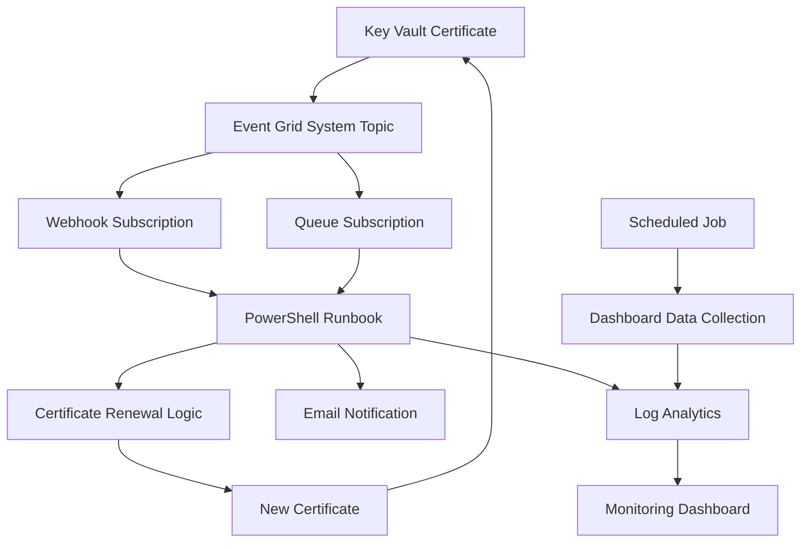

# Azure Certificate Management Services - Implementation Plan & Scripts

## Implementation Plan

Based on the Azure CertLC lab ARM template analysis, I've created a comprehensive set of Azure CLI scripts to deploy the Azure Certificate Management Services infrastructure. Here's the complete implementation plan:

### **Phase 1: Prerequisites and Setup** ✅
- [x] Environment variables configuration
- [x] Azure CLI validation and authentication  
- [x] Resource provider registration
- [x] Unique resource naming strategy

### **Phase 2: Core Infrastructure** ✅
- [x] **Azure Key Vault**
  - Standard SKU with RBAC authorization
  - Soft delete enabled (90-day retention)
  - Public network access enabled
  - Configured for certificate storage and event triggers

- [x] **Storage Account with Queue**
  - Standard_LRS storage with Hot access tier
  - TLS 1.2 minimum security
  - Queue service with `certlc` queue
  - Configured for certificate renewal request queuing

- [x] **Azure Automation Account**
  - Basic SKU with System Assigned Identity
  - PSPKI PowerShell module installation
  - Public network access enabled
  - Encryption with Microsoft-managed keys

- [x] **Log Analytics Workspace**
  - PerGB2018 pricing tier
  - 120-day data retention
  - Resource-based permissions
  - Custom table for certificate data

### **Phase 3: Event-Driven Architecture** ✅
- [x] **Event Grid System Topic**
  - Monitors Key Vault certificate events
  - Topic type: `microsoft.keyvault.vaults`
  - Location-based deployment

- [x] **Event Subscriptions**
  - **Webhook Subscription**: Immediate processing via webhook
  - **Queue Subscription**: Reliable processing via storage queue
  - Event filter: `Microsoft.KeyVault.CertificateNearExpiry`
  - Retry policy: 30 attempts, 1440-minute TTL

- [x] **Data Collection Infrastructure**
  - Data Collection Endpoint for Log Analytics
  - Data Collection Rule for custom log ingestion
  - Custom table: `Clcdata_CL` with certificate schema

### **Phase 4: Automation Components** ✅
- [x] **PowerShell Runbooks**
  - `CertLifeCycleMgmt`: Main certificate renewal logic
  - `CertLCDashboardDataInjestion`: Dashboard data collection
  - Downloaded from official Azure CertLC repository

- [x] **Automation Variables**
  - SMTP server configuration
  - Storage account references
  - Email notification settings
  - Data collection endpoints and rules
  - Certificate expiry thresholds

- [x] **Webhooks**
  - Secure webhook for Event Grid integration
  - 1-year expiration policy
  - Encrypted URI storage
  - Automatic runbook triggering

- [x] **Scheduled Jobs**
  - Certificate monitoring: Every 4 hours
  - Dashboard data injection: Every hour
  - Job schedule linkage to runbooks

### **Phase 5: Security and Access Control** ✅
- [x] **Role-Based Access Control (RBAC)**
  - **Key Vault Permissions**:
    - Key Vault Certificates Officer
    - Key Vault Secrets User
  - **Storage Account Permissions**:
    - Reader
    - Storage Queue Data Contributor
    - Storage Queue Data Message Processor
  - **Log Analytics Permissions**:
    - Monitoring Metrics Publisher
  - **Data Collection Permissions**:
    - Monitoring Metrics Publisher (DCR & DCE)

- [x] **Monitoring Setup**
  - Saved searches for certificate status
  - Custom KQL queries for dashboard
  - Resource-level permission assignments

### **Phase 6: Validation and Testing** ✅
- [x] **Deployment Validation Script**
  - Resource existence verification
  - Permission validation
  - Component connectivity testing
  - Comprehensive error reporting

## Delivered Scripts

### Core Scripts
1. **`01-environment-setup.sh`** - Environment configuration and prerequisites
2. **`02-core-infrastructure.sh`** - Key Vault, Storage, Automation, Log Analytics
3. **`03-event-grid-setup.sh`** - Event Grid topics, subscriptions, data collection
4. **`04-automation-setup.sh`** - Runbooks, webhooks, schedules, variables
5. **`05-rbac-permissions.sh`** - Security permissions and monitoring setup

### Orchestration Scripts
6. **`deploy-all.sh`** - Complete deployment orchestration with validation
7. **`validate-deployment.sh`** - Comprehensive deployment verification

### Documentation
8. **`README-AZURE-CLI.md`** - Complete deployment guide and troubleshooting

## Key Features Implemented

### 🔄 **Automated Certificate Lifecycle**
- Automatic detection of certificate near-expiry events
- Dual processing paths (webhook + queue) for reliability
- PowerShell-based renewal automation
- Email notifications for certificate events

### 📊 **Monitoring and Dashboards**
- Custom Log Analytics table for certificate data
- Pre-built KQL queries for certificate status
- Automated data collection every hour
- Saved searches for quick monitoring

### 🔒 **Enterprise Security**
- Managed identity authentication
- RBAC-based access control
- Encrypted webhook communications
- Soft delete protection on Key Vault

### ⚡ **Event-Driven Processing**
- Real-time Event Grid notifications
- Reliable queue-based processing
- Configurable retry policies
- Multiple event delivery endpoints

### 🛠 **Operational Excellence**
- Comprehensive validation scripts
- Detailed deployment logging
- Error handling and rollback capabilities
- Cost-optimized resource configuration

## Architecture Flow



## Usage Examples

### Complete Deployment
```bash
cd certificate-lifecycle-scripts
chmod +x deploy-all.sh
./deploy-all.sh
```

### Step-by-Step Deployment
```bash
./01-environment-setup.sh
./02-core-infrastructure.sh
./03-event-grid-setup.sh
./04-automation-setup.sh
./05-rbac-permissions.sh
```

### Validation
```bash
./validate-deployment.sh
```

## Resource Naming Convention

All resources use a consistent naming pattern with unique suffixes:

- **Resource Group**: `rg-certlc-prod`
- **Key Vault**: `kv-certlc-XXXXXX`
- **Storage Account**: `stcertlcXXXXXX`
- **Automation Account**: `aa-certlc-XXXXXX`
- **Event Grid Topic**: `egt-certlc-XXXXXX`
- **Log Analytics**: `law-certlc-XXXXXX`

## Cost Considerations

- **Estimated Monthly Cost**: $50-100 USD for moderate usage
- **Key Vault**: $0.03 per 10,000 operations
- **Storage**: $0.045/GB/month + operations
- **Automation**: $0.002/minute of execution
- **Event Grid**: $0.60/million operations
- **Log Analytics**: $2.30/GB ingested

## Next Steps

1. **Deploy the infrastructure** using the provided scripts
2. **Add certificates** to the Key Vault for monitoring
3. **Configure certificate expiry notifications** (default: 30 days)
4. **Create custom dashboards** in Log Analytics
5. **Test the end-to-end flow** with a short-lived certificate
6. **Set up alerting** for failed certificate renewals

This implementation provides a production-ready certificate lifecycle management system that matches the functionality of the original ARM template while offering the flexibility and transparency of Azure CLI deployment scripts.