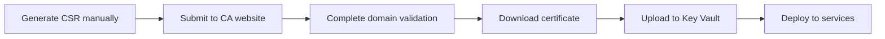
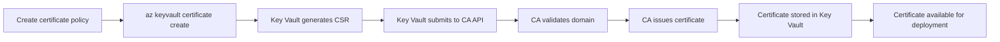

# Azure Key Vault Certificate Generation with Integrated CAs

## 📋 Overview

This document explains how Azure Key Vault automatically generates certificates using integrated Certificate Authorities (CAs) like DigiCert and GlobalSign. **The key insight**: You don't upload certificates - Azure Key Vault creates them for you through policy-driven automation.

## 🤔 Common Confusion

**❓ Question**: "If we don't have to upload the cert to Key Vault, how and when does the `api.example.com` certificate get generated?"

**✅ Answer**: Certificates are generated automatically when you create a certificate policy and run `az keyvault certificate create`. Key Vault handles the entire certificate lifecycle with the CA.

## 🔄 How Certificate Generation Actually Works

### Traditional Approach (Manual Upload)


### Integrated CA Approach (Automated)


## 🚀 Step-by-Step Certificate Generation Process

### Step 1: One Policy Per Certificate

Each certificate requires its own policy, even if they're similar:

```bash
# Certificate for api.example.com
cat > api-example-com-policy.json << 'EOF'
{
  "issuerParameters": {
    "name": "DigiCert"
  },
  "x509CertificateProperties": {
    "subject": "CN=api.example.com",
    "subjectAlternativeNames": {
      "dnsNames": ["api.example.com"]
    },
    "validityInMonths": 12
  },
  "lifetimeActions": [
    {
      "trigger": {
        "lifetimePercentage": 80
      },
      "action": {
        "actionType": "AutoRenew"
      }
    }
  ],
  "keyProperties": {
    "reuseKey": false,
    "keyType": "RSA",
    "keySize": 2048
  }
}
EOF

# Certificate for admin.example.com
cat > admin-example-com-policy.json << 'EOF'
{
  "issuerParameters": {
    "name": "DigiCert"
  },
  "x509CertificateProperties": {
    "subject": "CN=admin.example.com",
    "subjectAlternativeNames": {
      "dnsNames": ["admin.example.com"]
    },
    "validityInMonths": 12
  },
  "lifetimeActions": [
    {
      "trigger": {
        "lifetimePercentage": 80
      },
      "action": {
        "actionType": "AutoRenew"
      }
    }
  ],
  "keyProperties": {
    "reuseKey": false,
    "keyType": "RSA",
    "keySize": 2048
  }
}
EOF
```

### Step 2: Create Certificates with Policies

This is **when and how** the certificates are generated:

```bash
# Generate api.example.com certificate
az keyvault certificate create \
    --vault-name "my-keyvault" \
    --name "api-example-com-cert" \
    --policy @api-example-com-policy.json

# Generate admin.example.com certificate  
az keyvault certificate create \
    --vault-name "my-keyvault" \
    --name "admin-example-com-cert" \
    --policy @admin-example-com-policy.json
```

### Step 3: What Happens Behind the Scenes

When you run `az keyvault certificate create`:

1. **Immediate (1-2 seconds)**: Key Vault generates private key and CSR
2. **Immediate (1-2 seconds)**: CSR submitted to DigiCert API
3. **2-15 minutes**: DigiCert validates domain ownership
4. **1-5 minutes**: DigiCert issues the certificate
5. **1-2 seconds**: Certificate stored in Key Vault

**Total time: 5-22 minutes** for the certificate to be available.

## ⏰ When Certificate Generation Occurs

### Initial Generation Triggers
- **First-time creation**: When you run `az keyvault certificate create` with a new certificate name
- **Manual renewal**: When you run the same command with an existing certificate name
- **Auto-renewal**: When the certificate reaches its lifetime percentage trigger (e.g., 80% of validity period)

### Monitoring Certificate Creation

```bash
# Check certificate creation status
az keyvault certificate show \
    --vault-name "my-keyvault" \
    --name "api-example-com-cert" \
    --query "{Status:attributes.enabled, Created:attributes.created, Subject:policy.x509CertificateProperties.subject}"

# Monitor creation progress (during generation)
az keyvault certificate pending show \
    --vault-name "my-keyvault" \
    --name "api-example-com-cert"

# List all certificates in Key Vault
az keyvault certificate list \
    --vault-name "my-keyvault" \
    --query "[].{Name:name, Subject:policy.x509CertificateProperties.subject, ValidFrom:attributes.notBefore, ValidTo:attributes.expires, Status:attributes.enabled}" \
    --output table
```

## 🔑 Key Concepts

### 1. Policy-Driven Generation
- **No manual CSR generation**: Key Vault creates the CSR automatically
- **No manual CA submission**: Key Vault communicates with CA APIs
- **No manual certificate download**: Certificate is automatically stored

### 2. One-to-One Relationship
```
1 Domain = 1 Certificate = 1 Policy = 1 Certificate Name
```

### 3. Certificate Naming Convention
```bash
# Domain: api.example.com
# Certificate Name: api-example-com-cert

# Domain: admin.example.com  
# Certificate Name: admin-example-com-cert

# Wildcard Domain: *.example.com
# Certificate Name: wildcard-example-com-cert
```

## 🌟 Alternative: Wildcard Certificates

For multiple subdomains, you can use a single wildcard certificate:

```bash
# One policy for multiple subdomains
cat > wildcard-policy.json << 'EOF'
{
  "issuerParameters": {
    "name": "DigiCert"
  },
  "x509CertificateProperties": {
    "subject": "CN=*.example.com",
    "subjectAlternativeNames": {
      "dnsNames": ["*.example.com", "example.com"]
    },
    "validityInMonths": 12
  },
  "lifetimeActions": [
    {
      "trigger": {
        "lifetimePercentage": 80
      },
      "action": {
        "actionType": "AutoRenew"
      }
    }
  ]
}
EOF

# One certificate covers all subdomains
az keyvault certificate create \
    --vault-name "my-keyvault" \
    --name "wildcard-example-com-cert" \
    --policy @wildcard-policy.json
```

This single certificate can be used for:
- `api.example.com`
- `admin.example.com`
- `portal.example.com`
- `www.example.com`
- Any other `*.example.com` subdomain

## 🔍 Domain Validation Requirements

Before certificate generation, ensure domain validation is set up:

### DNS Validation (Recommended)
```bash
# Add CNAME record for domain validation
# Record: _dv.api.example.com
# Value: validation-token.digicert.com (provided by DigiCert)
```

### HTTP Validation
```bash
# Place validation file at:
# http://api.example.com/.well-known/pki-validation/validation-file.txt
```

### Email Validation
```bash
# Ensure you can receive email at one of:
# admin@api.example.com
# admin@example.com
# webmaster@example.com
```

## 📊 Certificate Strategy Comparison

| Strategy | Certificates | Policies | Use Case | Management |
|----------|--------------|----------|----------|------------|
| **Individual** | 1 per domain | 1 per certificate | Different renewal schedules, granular control | More policies to manage |
| **Wildcard** | 1 for all subdomains | 1 policy | Same renewal schedule, simplified management | Single point of failure |

## 🚀 Complete Example Script

Here's a practical example for generating multiple certificates:

```bash
#!/bin/bash
# generate-certificates.sh

VAULT_NAME="my-keyvault"

# Function to create certificate policy
create_cert_policy() {
    local domain="$1"
    local cert_name="$2"
    
    cat > "${cert_name}-policy.json" << EOF
{
  "issuerParameters": {"name": "DigiCert"},
  "x509CertificateProperties": {
    "subject": "CN=$domain",
    "subjectAlternativeNames": {"dnsNames": ["$domain"]},
    "validityInMonths": 12
  },
  "lifetimeActions": [{
    "trigger": {"lifetimePercentage": 80},
    "action": {"actionType": "AutoRenew"}
  }]
}
EOF
}

# Function to create certificate
create_certificate() {
    local cert_name="$1"
    
    echo "Creating certificate: $cert_name"
    az keyvault certificate create \
        --vault-name "$VAULT_NAME" \
        --name "$cert_name" \
        --policy "@${cert_name}-policy.json"
}

# Define certificates to create
declare -A certificates=(
    ["api.example.com"]="api-example-com-cert"
    ["admin.example.com"]="admin-example-com-cert"
    ["portal.example.com"]="portal-example-com-cert"
)

# Create policies and certificates
for domain in "${!certificates[@]}"; do
    cert_name="${certificates[$domain]}"
    echo "Processing: $domain -> $cert_name"
    
    # Step 1: Create policy
    create_cert_policy "$domain" "$cert_name"
    
    # Step 2: Create certificate with policy
    create_certificate "$cert_name"
    
    echo "Certificate generation initiated for $domain"
    echo "---"
done

echo "All certificate generation requests submitted!"
echo "Certificates will be available in 5-22 minutes."
```

## 🔄 Auto-Renewal Timeline

Once created, certificates automatically renew:

```
Day 0:   Certificate created (valid for 365 days)
Day 292: Auto-renewal triggered (80% of lifetime)
Day 293: New certificate version available
Day 365: Old certificate expires
```

## ✅ Summary

**Key Takeaways:**
1. **No uploads needed** - Key Vault generates certificates automatically
2. **Policy-driven** - Each certificate needs a policy defining its properties
3. **One command triggers generation** - `az keyvault certificate create` starts the entire process
4. **Automatic renewal** - Certificates renew themselves based on policy settings
5. **Domain validation required** - Ensure you can prove domain ownership before generation

This approach eliminates manual certificate management while providing enterprise-grade automation and security.