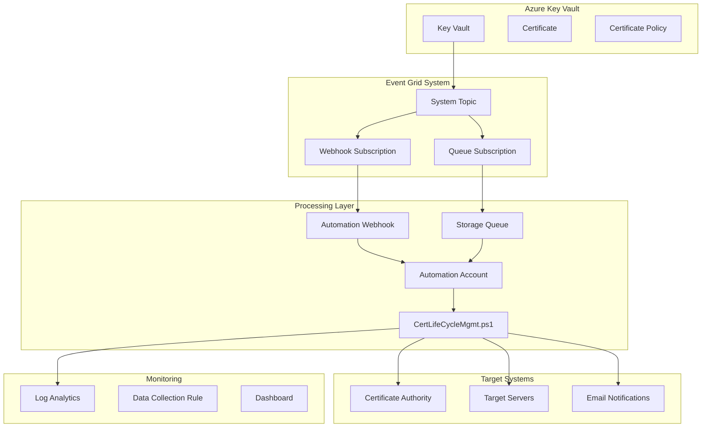

# Certificate Lifecycle Deployment Scripts

This directory contains operational and diagnostic scripts for Azure Certificate Lifecycle Management. These scripts complement both the original ARM template deployment and the enhanced Azure CLI implementation, providing additional deployment options, diagnostic tools, and maintenance utilities.

## Centralized Configuration System

All scripts now use a centralized `.env` configuration file that can auto-populate from your existing deployment.

### Quick Setup for Existing LAB Deployment:
```bash
# Auto-detect configuration from your deployed resources
./config.sh auto-populate --resource-group <rg-your-lab-name>

# Validate the configuration  
./config.sh validate

# Now all scripts use your configuration automatically!
./diagnostics/diagnose-keyvault.sh
```

📖 **[Complete Configuration Guide](CONFIGURATION_GUIDE.md)** - Detailed setup instructions

## 📁 **Organized Structure**

The scripts are now organized into logical subdirectories for better navigation:

```
certlc-deployment-scripts/
├── 📊 monitoring/           # Certificate lifecycle monitoring and analysis tools
├── 🚀 deployment/          # Deployment scripts and ARM templates  
├── 🧪 testing/             # Certificate testing and development tools
├── 🔍 diagnostics/         # Diagnostic and troubleshooting scripts
├── 📚 docs/               # Comprehensive documentation
├── config.sh               # 🔧 Configuration manager (auto-populate from deployment)
├── common.sh               # 🔧 Common configuration loader
├── quick-status.sh         # ⚡ Convenience script for quick status check
└── run-full-analysis.sh    # 🔍 Convenience script for full analysis
```

## ⚡ **Quick Start**

### Fast Status Check (30 seconds)
```bash
./quick-status.sh
```

### Comprehensive Analysis (2-3 minutes)  
```bash
./run-full-analysis.sh
```

### Browse Tools by Category
```bash
ls monitoring/     # Certificate monitoring tools
ls deployment/     # Deployment scripts
ls testing/        # Testing utilities
ls diagnostics/    # Diagnostic tools
ls docs/          # Documentation
```

## 🎯 Purpose

These scripts are derived from the original Microsoft Certificate Lifecycle project and enhanced for better operational support. They provide:

- **Partial deployment options** for specific components
- **Diagnostic and troubleshooting utilities**
- **Status checking and validation tools**
- **Testing and development helpers**
- **Specialized deployment scenarios**

## 📁 **Detailed Directory Contents**

### 📊 **monitoring/** - Certificate Lifecycle Monitoring
- `cert-quick-status.sh` - ⚡ Fast 30-second health check with auto-discovery
- `cert-lifecycle-status.sh` - 🔍 Comprehensive end-to-end lifecycle analysis  
- `cert-lifecycle-events.ps1` - 📊 PowerShell deep analysis with event correlation
- `investigate-job-output.ps1` - 🔎 Detailed automation job investigation

### 🚀 **deployment/** - Deployment Scripts and Templates
- `deploy.sh` - Main deployment script using ARM templates
- `deploy-keyvault-only.sh` - Deploy only Key Vault components
- `deploy-missing-resources.sh` - Deploy missing or failed resources
- `keyvault-only-template.json` - Key Vault-specific ARM template
- `parameters.json` - Configuration parameters template

### 🔍 **diagnostics/** - Diagnostic and Troubleshooting Tools
- `check-deployment-status.sh` - Check status of deployed resources
- `check-keyvault-names.sh` - Validate Key Vault naming availability for ARM template redeployment
- `diagnose-keyvault.sh` - Comprehensive Key Vault diagnostics
- `fix-keyvault-access.sh` - 🆕 Fix Key Vault network access issues (public access disabled)

### 🧪 **testing/** - Testing and Development Tools
- `create-expired-cert.ps1` - Create expired certificates for testing
- `create-shortlived-cert.ps1` - Create short-lived certificates for testing
- `manual-cert-creation.ps1` - Manual certificate creation utilities

### 📚 **docs/** - Comprehensive Documentation
- `CERTIFICATE_MONITORING_GUIDE.md` - Complete monitoring guide and workflows
- `DEPLOYMENT_OVERVIEW.md` - Comprehensive deployment guidance
- `MONITORING_SOLUTION_SUMMARY.md` - Overview of monitoring capabilities
- `deploy-commands.md` - Command reference and examples
- `complete-certificate-renewal.md` - Certificate renewal procedures

## 🚀 **Usage Examples**

### For Daily Monitoring:
```bash
# Quick health check (30 seconds)
./quick-status.sh
```

### For Weekly Analysis:
```bash
# Comprehensive monitoring (2-3 minutes)
./run-full-analysis.sh
```

### For Troubleshooting:
```bash
# Check specific deployments
./diagnostics/check-deployment-status.sh

# Fix Key Vault access issues (new!)
./diagnostics/fix-keyvault-access.sh

# Diagnose Key Vault problems
./diagnostics/diagnose-keyvault.sh
```

# Diagnose Key Vault issues
./diagnostics/diagnose-keyvault.sh

# Deep PowerShell analysis
pwsh ./monitoring/cert-lifecycle-events.ps1 -Detailed
```

### For Testing:
```bash
# Create test certificates
pwsh ./testing/create-shortlived-cert.ps1

# Monitor test renewal
./monitoring/cert-quick-status.sh
```

## 📚 Additional Resources

- **[Certificate Monitoring Guide](./docs/CERTIFICATE_MONITORING_GUIDE.md)** - Complete guide to certificate lifecycle monitoring
- **[Enhanced Azure CLI Scripts](../certificate-lifecycle-scripts/)** - Full Azure CLI implementation
- **[Original ARM Templates](https://github.com/Azure-Samples/certificate-lifecycle-management)** - Microsoft's reference implementation

## 🎯 Benefits of Organization

### ✅ **Easier Navigation**
- Logical grouping by function
- Clear separation of concerns
- Reduced clutter in main directory

### ✅ **Better Discoverability**
- Category-specific README files
- Convenience scripts for common tasks
- Clear tool purpose identification

### ✅ **Improved Maintenance**
- Isolated tool categories
- Focused documentation per category
- Easier updates and modifications

### ✅ **Enhanced User Experience**
- Quick start options with convenience scripts
- Progressive disclosure of complexity
- Context-aware tool recommendations

---

## 🏁 Getting Started

1. **Quick Overview**: Run `./quick-status.sh` for immediate health check
2. **Explore Categories**: Browse `monitoring/`, `deployment/`, `testing/`, `diagnostics/` directories
3. **Read Documentation**: Check `docs/` for comprehensive guides
4. **Run Analysis**: Use `./run-full-analysis.sh` for detailed insights

The reorganized structure makes it easy to find exactly what you need while maintaining the powerful capabilities of all certificate lifecycle management tools! 🎉

---

## 🏗️ **Certificate Lifecycle System Architecture**

### **Complete System Flow Overview**

The Azure Certificate Lifecycle Management system follows a sophisticated event-driven architecture that automatically handles certificate renewal from detection through deployment. Here's how the complete system works:



### **🔄 Detailed Flow Phases**

#### **Phase 1: Certificate Policy & Monitoring Setup**

##### **📋 Step-by-Step Implementation Instructions**

**Step 1: Configure Certificate Policy in Key Vault**
```bash
# 1.1 Set the certificate policy for automatic renewal triggers
az keyvault certificate set-policy \
    --vault-name "kv-certlc-yoursuffix" \
    --name "your-certificate-name" \
    --policy '{
        "lifetimeActions": [
            {
                "trigger": {
                    "lifetimePercentage": 80
                },
                "action": {
                    "actionType": "AutoRenew"
                }
            }
        ],
        "issuerParameters": {
            "name": "Self"  # or your CA issuer name
        },
        "certificateProperties": {
            "validityInMonths": 12,  # Configure based on your needs
            "renewOnCertificateExpiry": true
        }
    }'

# 1.2 Verify the policy is correctly set
az keyvault certificate show-policy \
    --vault-name "kv-certlc-yoursuffix" \
    --name "your-certificate-name"
```

**Step 2: Configure Automation Account Variables**
```bash
# 2.1 Set the critical expiration threshold (30-day safety buffer)
az automation variable create \
    --automation-account-name "aa-certlc-yoursuffix" \
    --resource-group "rg-certlc-yoursuffix" \
    --name "CertExpiryDays" \
    --value "30" \
    --description "Days before expiry to actually process renewal (prevents premature triggers)"

# 2.2 Configure certificate lifetime detection
az automation variable create \
    --automation-account-name "aa-certlc-yoursuffix" \
    --resource-group "rg-certlc-yoursuffix" \
    --name "DefaultCertificateLifetime" \
    --value "365" \
    --description "Default certificate lifetime in days for policy calculations"

# 2.3 Set up compliance year for automatic lifetime adjustment
az automation variable create \
    --automation-account-name "aa-certlc-yoursuffix" \
    --resource-group "rg-certlc-yoursuffix" \
    --name "ComplianceTransitionYear" \
    --value "2029" \
    --description "Year when 47-day certificates become mandatory"
```

**Step 3: Update PowerShell Runbook Logic**
```powershell
# 3.1 Add this logic to your CertLifeCycleMgmt.ps1 runbook:

# Enhanced certificate policy detection
function Get-CertificateLifetimeInfo {
    param(
        [string]$VaultName,
        [string]$CertificateName
    )
    
    # Get certificate details
    $cert = Get-AzKeyVaultCertificate -VaultName $VaultName -Name $CertificateName
    $policy = Get-AzKeyVaultCertificatePolicy -VaultName $VaultName -Name $CertificateName
    
    # Calculate actual lifetime
    $issueDate = $cert.Certificate.NotBefore
    $expiryDate = $cert.Certificate.NotAfter
    $actualLifetimeDays = ($expiryDate - $issueDate).Days
    
    # Determine trigger threshold based on policy
    $lifetimePercentage = $policy.LifetimeActions[0].Trigger.LifetimePercentage
    $policyTriggerDays = [math]::Round($actualLifetimeDays * (100 - $lifetimePercentage) / 100)
    
    return @{
        ActualLifetimeDays = $actualLifetimeDays
        PolicyTriggerDays = $policyTriggerDays
        ExpiryDate = $expiryDate
        IssueDate = $issueDate
    }
}

# Enhanced expiration threshold check
function Test-CertificateRenewalEligibility {
    param(
        [string]$VaultName,
        [string]$CertificateName
    )
    
    # Get automation variables
    $CertExpiryDays = Get-AutomationVariable -Name "CertExpiryDays"
    $ComplianceYear = Get-AutomationVariable -Name "ComplianceTransitionYear"
    
    # Get certificate lifetime information
    $certInfo = Get-CertificateLifetimeInfo -VaultName $VaultName -CertificateName $CertificateName
    
    # Calculate days until expiry
    $daysUntilExpiry = ($certInfo.ExpiryDate - (Get-Date)).Days
    
    # Apply threshold protection
    if ($daysUntilExpiry -gt $CertExpiryDays) {
        Write-Output "THRESHOLD CHECK FAILED: Certificate expires in $daysUntilExpiry days, threshold is $CertExpiryDays days"
        return $false
    }
    
    # Future compliance check
    $currentYear = (Get-Date).Year
    if ($currentYear -ge $ComplianceYear -and $certInfo.ActualLifetimeDays -gt 47) {
        Write-Output "COMPLIANCE CHECK: Certificate lifetime ($($certInfo.ActualLifetimeDays) days) exceeds 47-day limit for year $currentYear"
    }
    
    Write-Output "ELIGIBILITY PASSED: Certificate is eligible for renewal"
    return $true
}
```

**Step 4: Configure Event Grid System Topic**
```bash
# 4.1 Create or verify Event Grid system topic for Key Vault
az eventgrid system-topic create \
    --name "keyvault-certlc-topic" \
    --resource-group "rg-certlc-yoursuffix" \
    --location "eastus" \
    --topic-type "Microsoft.KeyVault.vaults" \
    --source "/subscriptions/your-subscription-id/resourceGroups/rg-certlc-yoursuffix/providers/Microsoft.KeyVault/vaults/kv-certlc-yoursuffix"

# 4.2 Verify the system topic is active
az eventgrid system-topic show \
    --name "keyvault-certlc-topic" \
    --resource-group "rg-certlc-yoursuffix" \
    --query "{Name:name,ProvisioningState:provisioningState,TopicType:topicType}"
```

**Step 5: Set Up Monitoring and Alerting**
```bash
# 5.1 Create custom Log Analytics table for certificate events
az monitor log-analytics workspace table create \
    --workspace-name "law-certlc-yoursuffix" \
    --resource-group "rg-certlc-yoursuffix" \
    --name "CertificateLifecycle_CL" \
    --columns '[
        {"name": "TimeGenerated", "type": "datetime"},
        {"name": "CertName", "type": "string"},
        {"name": "VaultName", "type": "string"},
        {"name": "ExpiryDate", "type": "datetime"},
        {"name": "DaysUntilExpiry", "type": "int"},
        {"name": "LifetimeDays", "type": "int"},
        {"name": "PolicyTriggerDays", "type": "int"},
        {"name": "ThresholdDays", "type": "int"},
        {"name": "RenewalEligible", "type": "boolean"},
        {"name": "EventType", "type": "string"},
        {"name": "ProcessingStatus", "type": "string"}
    ]' \
    --retention-in-days 90

# 5.2 Create alert rule for certificate policy issues
az monitor scheduled-query create \
    --name "CertificatePolicy-PrematureRenewal-Alert" \
    --resource-group "rg-certlc-yoursuffix" \
    --scopes "/subscriptions/your-subscription-id/resourceGroups/rg-certlc-yoursuffix/providers/Microsoft.OperationalInsights/workspaces/law-certlc-yoursuffix" \
    --condition "count 'GreaterThan' 0" \
    --condition-query "CertificateLifecycle_CL | where EventType == 'PrematureRenewalBlocked' and TimeGenerated > ago(1h)" \
    --description "Alert when certificate renewals are blocked due to premature triggering" \
    --evaluation-frequency "PT15M" \
    --window-size "PT1H" \
    --severity 2
```

**Step 6: Validation and Testing**
```bash
# 6.1 Test certificate policy detection
./diagnostics/check-deployment-status.sh

# 6.2 Validate automation variables
az automation variable list \
    --automation-account-name "aa-certlc-yoursuffix" \
    --resource-group "rg-certlc-yoursuffix" \
    --query "[?name=='CertExpiryDays' || name=='DefaultCertificateLifetime']"

# 6.3 Test runbook with threshold logic
az automation runbook start \
    --automation-account-name "aa-certlc-yoursuffix" \
    --resource-group "rg-certlc-yoursuffix" \
    --name "CertLifeCycleMgmt" \
    --parameters '{"TestMode": "true", "CertificateName": "your-test-cert"}'
```

**Configuration Summary:**
```bash
# Key Configuration Values Set:
Certificate Lifetime Trigger: 80% of total lifetime
- 12-month cert → Triggers at 72 days before expiry
- 47-day cert → Triggers at ~10 days before expiry (future compliance)

Expiration Threshold: 30 days (prevents premature renewals)
- Only processes certificates within 30 days of actual expiry
- Protects against policy-based early triggers

Monitoring: Custom Log Analytics table with alerting
Compliance: Ready for 2029 47-day certificate transition
```

#### **Phase 2: Event Detection & Routing**
```bash
# Key Vault Certificate Near Expiry Event
Event Type: "Microsoft.KeyVault.CertificateNearExpiry"
Trigger Condition: Certificate reaches 80% of its configured lifetime

# Dual Routing Strategy for Reliability:
Route 1: Event Grid → Webhook → Automation Account (Real-time)
Route 2: Event Grid → Storage Queue → Polling (Reliable backup)

# Event Grid Configuration:
- Max Delivery Attempts: 30
- Event TTL: 1440 minutes (24 hours)
- Batch Size: 1 event per batch
```

#### **Phase 3: Automation Processing**
The `CertLifeCycleMgmt.ps1` runbook implements sophisticated processing logic:

```powershell
# 1. Idempotency Protection
$jobLockKey = "CertRenewal_$($CertificateName)"
if (Test-JobLock -Key $jobLockKey) {
    Write-Output "Job already running for $CertificateName"
    return  # Prevents duplicate processing
}

# 2. Expiration Threshold Validation
$daysUntilExpiry = ($cert.Expires - (Get-Date)).Days
if ($daysUntilExpiry -gt $CertExpiryDays) {
    Write-Output "Certificate expires in $daysUntilExpiry days, threshold is $CertExpiryDays"
    return  # Prevents premature renewal
}

# 3. CA Authority Detection & Routing
if ($cert.Issuer -match "DigiCert|GlobalSign|Entrust|GoDaddy") {
    # External CA Processing Path
    Invoke-ExternalCARenewal -Certificate $cert
} else {
    # Internal CA Processing Path  
    Invoke-InternalCARenewal -Certificate $cert
}
```

### **🔧 CA Authority Workflow Differences**

#### **External CAs (DigiCert, GlobalSign, Entrust, etc.)**
```bash
Processing Flow:
1. Generate Certificate Signing Request (CSR) from Key Vault
2. Submit CSR to external CA via API or web portal
3. Await CA domain/organization validation process
4. Retrieve signed certificate from CA
5. Import completed certificate back to Key Vault
6. Deploy certificate to target systems
7. Send completion notifications

Timeline: 1-24 hours (depends on CA validation requirements)
Automation Level: Semi-automated (may require manual validation steps)
Dependencies: CA API availability, validation processes
```

#### **Internal CA (Current System Setup)**
```bash
Processing Flow:
1. Generate Certificate Signing Request (CSR) from Key Vault
2. Submit CSR to internal Certificate Authority (CA01 server)
3. Auto-approve based on internal certificate policy
4. Retrieve signed certificate from internal CA
5. Import certificate back to Key Vault
6. Deploy to target systems via SSH key chain
7. Send completion notifications

Timeline: Minutes to hours
Automation Level: Fully automated end-to-end
Dependencies: Internal CA availability, SSH key chain
```

### **🔐 Security & Access Model**

#### **RBAC Permissions Structure**
```bash
Automation Account Managed Identity Permissions:
├── Key Vault Certificate Officer (Key Vault scope)
├── Storage Queue Data Contributor (Storage Account scope)  
├── Monitoring Metrics Publisher (Log Analytics scope)
├── Custom CA Management Role (Resource Group scope)
└── Network Access for SSH deployment

SSH Key Chain for Target Deployment:
CA01 Server Access:
├── Private Key: Internal CA certificate signing
├── SSH Keys: Secure access to target Linux servers
├── PowerShell Remoting: Windows system deployment
└── Network Access: Cross-system connectivity
```

#### **Configuration Variables**
```bash
# Core Certificate Management Settings
SMTPServer: "your-smtp-server.domain.com"
StorageAccount: "stcertlc[unique-suffix]" 
EmailRecipient: "certificates@yourdomain.com"
CertExpiryDays: "30"  # Threshold protection

# Advanced Monitoring & Integration
DataCollectionEndpoint: "dce-certlc-[suffix].eastus-1.ingest.monitor.azure.com"
DataCollectionRuleId: "[immutable-rule-id]"
TableName: "CertificateLifecycle"
WebhookURI: "[encrypted-webhook-endpoint]"
```

### **📊 Monitoring & Observability Pipeline**

```bash
# Data Collection & Analysis Flow
1. Certificate events captured by Event Grid System Topic
2. Event data routed through Data Collection Rule (DCR)
3. Structured data stored in custom Log Analytics table
4. Real-time dashboard visualization and alerting
5. Historical trend analysis and compliance reporting

# Captured Event Types:
- Certificate near expiry detection
- Renewal process initiation  
- CA interaction status and timing
- Target system deployment success/failure
- Error conditions and retry attempts
- Performance metrics and bottlenecks
```

### **🚨 Error Handling & Resilience Features**

```bash
# Multi-Layer Reliability Architecture:
1. Dual Event Routing: Webhook + Queue ensures delivery
2. Event Grid Retry Policy: 30 attempts over 24 hours
3. Job Locking: Prevents duplicate concurrent processing
4. Expiration Threshold: Prevents premature trigger responses
5. Scheduled Backup Monitoring: Every 4 hours as safety net
6. Dashboard Data Injection: Hourly observability updates
7. Dead Letter Queue: Captures failed events for investigation
```

### **🎯 Key Operational Differences: External vs Internal CA**

| Aspect | External CA (DigiCert/GlobalSign) | Internal CA (Current Setup) |
|--------|-----------------------------------|-------------------------|
| **Validation Process** | Domain/Organization validation required | Policy-based auto-approval |
| **Processing Timeline** | Hours to days depending on validation | Minutes for automated flow |
| **Cost Structure** | Per-certificate licensing fees | Infrastructure operational cost |
| **Automation Level** | API-dependent, potential manual steps | Fully automated end-to-end |
| **Security Model** | External CA trust and security | Internal infrastructure security |
| **Compliance Level** | Industry-standard public trust | Internal organizational trust |
| **Scalability** | Limited by CA rate limits | Limited by internal infrastructure |

### **🔮 47-Day Certificate Transition Impact**

With the upcoming CA/Browser Forum mandate reducing certificate lifetimes to 47 days by 2029:

```bash
# Timeline Impact Analysis:
Current State: 12-month certificates → 72 days early renewal trigger
Future State: 47-day certificates → ~10 days early renewal trigger

# System Readiness Assessment:
✅ 30-day expiration threshold already handles shorter lifecycles
✅ Configurable lifetime detection supports variable periods
✅ Automated renewal pipeline scales to faster frequency  
✅ Monitoring system captures shorter certificate lifecycles
✅ Event-driven architecture handles increased event volume
✅ Dual routing ensures reliability with higher frequency

# Operational Benefits:
- Reduced certificate compromise exposure window
- More frequent validation of renewal processes
- Enhanced monitoring and alerting capabilities
- Improved automation reliability testing
```

### **🎯 System Benefits & Capabilities**

This enterprise-grade certificate lifecycle management system provides:

- **Real-time Event Processing**: Immediate response to certificate expiry events
- **Reliable Backup Processing**: Queue-based processing ensures no events are lost
- **Multi-CA Support**: Handles both external and internal certificate authorities
- **Advanced Security**: RBAC-based access with managed identity integration
- **Comprehensive Monitoring**: Full observability pipeline with custom dashboards
- **Error Resilience**: Multiple layers of error handling and retry logic
- **Future Compliance**: Ready for upcoming 47-day certificate lifetime requirements
- **Scalable Architecture**: Designed to handle increasing certificate volumes

The system successfully balances automation efficiency with operational safety, providing both immediate responsiveness and reliable backup processing while maintaining comprehensive audit trails and monitoring capabilities.